# Arena Timer Firmware — Codebase Bundle

_Single-file snapshot for Claude.ai Project context. Generated 2026-06-07 14:59 UTC from branch `claude/happy-wright-ZNzX9` @ `8580e1e`._

This bundle contains the project's **own** firmware source, headers, build config, and docs.
Third-party libraries (Adafruit_Protomatter, WebSockets, EthernetBonjour), binaries (3D models, KiCad, PDFs), and backups are intentionally excluded.

## Contents

1. `README.md`
2. `platformio.ini`
3. `docs/INTEGRATION_GUIDE.md`
4. `docs/PINOUT.md`
5. `docs/POE_FEATHERWING_REF.md`
6. `wiring_connections.md`
7. `include/Timer.h`
8. `include/TimerDisplay.h`
9. `include/RGBMatrix.h`
10. `include/WebServer.h`
11. `include/WebSocketClient.h`
12. `include/Ethernet.h`
13. `src/main.cpp`
14. `src/Timer.cpp`
15. `src/TimerDisplay.cpp`
16. `src/WebServer.cpp`
17. `src/WebSocketClient.cpp`

---

## `README.md`

```markdown
# Arena Timer Firmware

A professional countdown timer system for competitive arenas, combat sports, and event timing. Built on the Waveshare RP2040-Zero with a vibrant 64x32 RGB LED matrix display, web-based control, and seamless integration with [FightTimer](https://github.com/PongAlmighty/FightTimer) by PongAlmighty.

## Features

### Display & Visual Customization
- **64x32 RGB LED Matrix** with full color control
- **Dynamic Color Thresholds** - automatically change colors as time decreases
- **Multiple Font Choices** - Sans, Serif, Monospace, Retro/Pixel styles
- **Adjustable Brightness** - 0-255 levels for any lighting condition
- **Character Spacing Control** - fine-tune text appearance
- **Display Rotation** - flip orientation 180° with one button

### Timer Controls
- **Countdown Mode** - configurable duration up to 60 minutes
- **Start/Pause/Reset** - full manual control
- **Sub-Second Precision** - displays tenths of seconds under 1 minute
- **Visual States** - blinking when paused, flashing when expired

### Web Interface
- **Responsive Three-Column Layout** - Timer controls, color settings, system status
- **Real-Time Console** - live event logging with timestamps
- **Live Updates** - automatic status refresh and button state management
- **Mobile Friendly** - works on phones, tablets, and desktops

### Network & Integration
- **DHCP Support** with static IP fallback (10.0.0.21)
- **mDNS Hostname** - access via `http://arenatimer.local`
- **FightTimer Integration** - Socket.IO connection for synchronized timing (credit: [PongAlmighty](https://github.com/PongAlmighty/))
- **RESTful API** - control timer programmatically

## Hardware

### Required Components
- **Silicognition RP2040-Shim** microcontroller
  - Designed to solder directly to the HUB75 input header on the back of the matrix
  - Provides integrated power regulation (5V to 3.3V)
- **64x32 RGB LED Matrix Panel** (HUB75 interface, P5 pitch recommended)
- **W5500 Ethernet Module** (SPI interface, PoE-FeatherWing or compatible)
- **5V Power Supply** (minimum 2A, 4A recommended for full brightness / more pixels)
  - I used a 5V 20W PoE splitter mounted to the back of the enclosure

### Pin Configuration

**Important:** This firmware uses a specific pin mapping optimized for the RP2040-Shim mounting directly to the HUB75 header. The Ethernet module uses SPI1 to avoid conflicts with the Matrix control signals.

#### RP2040-Shim GPIO Pinout

| RP2040 GPIO | Function | Peripheral | Shim Label | Notes |
|-------------|----------|------------|------------|-------|
| **GPIO 0** | Output Enable (OE) | Matrix | TX | Active low |
| **GPIO 1** | Latch (LAT) | Matrix | RX | |
| **GPIO 6** | Red Data 2 (R2) | Matrix | D4 | Bottom half |
| **GPIO 10** | SPI Clock | Ethernet | SCK | SPI1 |
| **GPIO 11** | SPI MOSI | Ethernet | MOSI | SPI1 |
| **GPIO 12** | SPI MISO | Ethernet | MISO | SPI1 |
| **GPIO 16** | Red Data 1 (R1) | Matrix | SDA | Top half |
| **GPIO 17** | Green Data 1 (G1) | Matrix | SCL | Top half |
| **GPIO 19** | Green Data 2 (G2) | Matrix | D6 | Bottom half |
| **GPIO 20** | Blue Data 1 (B1) | Matrix | D9 | Top half |
| **GPIO 21** | SPI Chip Select | Ethernet | D11 | CS for W5500 |
| **GPIO 22** | Matrix Clock (CLK) | Matrix | D13 | Pixel clock |
| **GPIO 25** | Blue Data 2 (B2) | Matrix | D25 | Bottom half |
| **GPIO 26** | Address D | Matrix | A3 | Row select |
| **GPIO 27** | Address C | Matrix | A2 | Row select |
| **GPIO 28** | Address B | Matrix | A1 | Row select |
| **GPIO 29** | Address A | Matrix | A0 | Row select |

> **Warning:** GPIO 24 is hardwired to VBUS sensing. Never use for I/O or the board will crash.

#### HUB75 Connector Pinout (Matrix Side)

| HUB75 Pin | Signal | RP2040 GPIO | Function |
|-----------|--------|-------------|----------|
| 1 | R1 | GPIO 16 | Red Data (Top) |
| 2 | G1 | GPIO 17 | Green Data (Top) |
| 3 | B1 | GPIO 20 | Blue Data (Top) |
| 4 | GND | - | Ground |
| 5 | R2 | GPIO 6 | Red Data (Bottom) |
| 6 | G2 | GPIO 19 | Green Data (Bottom) |
| 7 | B2 | GPIO 25 | Blue Data (Bottom) |
| 8 | GND | - | Ground |
| 9 | A | GPIO 29 | Address A |
| 10 | B | GPIO 28 | Address B |
| 11 | C | GPIO 27 | Address C |
| 12 | D | GPIO 26 | Address D |
| 13 | CLK | GPIO 22 | Pixel Clock |
| 14 | LAT | GPIO 1 | Latch |
| 15 | OE | GPIO 0 | Output Enable |
| 16 | GND | - | Ground |

> **Note:** The RP2040-Shim is powered by connecting 5V from the matrix power supply to the VUSB pin (3rd pin on right header). The onboard regulator converts this to 3.3V for logic. Do not connect USB while external 5V is applied unless using a data-only cable.

For complete wiring diagrams and PCB design files, see [wiring_connections.md](wiring_connections.md).

### Custom PCB & 3D Enclosure

**Custom PCB** is currently in production and will be added to this repository once tested and verified.

**3D Enclosure** files for a custom LED matrix enclosure are available in the `3d-models/` directory:
- `Timer Assembly v23.step` - STEP format for CAD editing
- `Timer Assembly v23.f3z` - Fusion 360 archive format

Files are print-ready and designed for:
- Standard 64x32 P5 RGB matrix panels
- RP2040-Shim direct mounting to HUB75 header
- PoE splitter bracket mount

## Quick Start

### 1. Flash Firmware
```bash
pio run --target upload
```

### 2. Network Connection
The timer will attempt DHCP, then fall back to `10.0.0.21` if unavailable. The assigned IP displays on the matrix for 5 seconds at startup.

### 3. Web Interface
Access the control panel at:
- `http://arenatimer.local` (mDNS)
- `http://[IP_ADDRESS]` (direct)

Use the web interface to:
- Start, pause, and reset the timer
- Set duration (minutes and seconds)
- Configure color thresholds for time-based alerts
- Adjust display settings (font, brightness, letter spacing)
- Flip display orientation
- Monitor system status and event logs

### 4. FightTimer Integration
To connect with FightTimer:
1. Ensure FightTimer is running on your network
2. In the **WebSocket Connection** section, enter:
   - **Host**: IP address of the computer running FightTimer
   - **Port**: `8765` (default Socket.IO port)
   - **Path**: `/socket.io/`
3. Click **Connect**

The timer will automatically sync with FightTimer's start/stop/reset commands and duration settings.

**What Gets Synchronized:**
- ✅ Timer start/stop/reset commands
- ✅ Duration changes
- ✅ Time remaining updates
- ✅ Expired/paused states

FightTimer sends `timer_update` events via Socket.IO that control the Arena Timer display.

**Alternative connection methods:**

Via code in `src/main.cpp`:
```cpp
void setup() {
    // ... existing setup code ...
    wsClient->connect("192.168.1.100", 8765, "/socket.io/");
}
```

Via API endpoint:
```bash
curl -X POST "http://arenatimer.local/api/websocket/connect" \
  -d "host=192.168.1.100&port=8765&path=/socket.io/"
```

## Configuration

### Network Settings
Edit `src/main.cpp` to change network defaults:
```cpp
uint8_t mac[] = {0xDE, 0xAD, 0xBE, 0xEF, 0xFE, 0xED};  // MAC address
uint8_t static_ip[] = {10, 0, 0, 21};                   // Static IP fallback
const char* hostname = "arenatimer";                     // mDNS hostname
```

### Display Settings
Configure default display settings in `src/main.cpp`:
```cpp
// Set default font
timerDisplay.setFont(&FreeSansBold12pt7b);

// Set default duration (hours, minutes, seconds)
timerDisplay.getTimer().setDuration({0, 3, 0});  // 3 minutes

// Color thresholds (set via web interface or programmatically)
timerDisplay.addColorThreshold(120, 255, 255, 0);  // Yellow at 2 minutes
timerDisplay.addColorThreshold(60, 255, 0, 0);     // Red at 1 minute
```

### Available Fonts
- **Sans**: `FreeSans9pt7b`, `FreeSans12pt7b`, `FreeSansBold9pt7b`, `FreeSansBold12pt7b`
- **Serif**: `FreeSerif9pt7b`, `FreeSerif12pt7b`, `FreeSerifBold9pt7b`, `FreeSerifBold12pt7b`
- **Mono**: `FreeMono9pt7b`, `FreeMono12pt7b`, `FreeMonoBold9pt7b`, `FreeMonoBold12pt7b`
- **Retro**: `Org_01`, `Picopixel`, `TomThumb` (ultra-compact pixel fonts)
- **Custom**: `Aquire_BW0ox12pt7b`, `AquireBold_8Ma6012pt7b`, `AquireLight_YzE0o12pt7b`

### Pin Configuration
Default pins are defined in `include/RGBMatrix.h` for the Waveshare RP2040-Zero. Modify if using different pin connections.

### Performance Optimization
The firmware includes debug flags that can be disabled for optimal timing performance:

```cpp
// src/main.cpp
#define DEBUG_MAIN false

// src/WebServer.cpp
#define DEBUG_WEBSERVER false

// src/WebSocketClient.cpp
#define DEBUG_WEBSOCKET false
```

When all debug flags are `false`, Serial output is disabled, eliminating timing delays. This is recommended for production use.

## API Reference

The timer exposes a RESTful API for programmatic control:

### Timer Control
```bash
# Start timer
POST /api?action=start

# Pause timer
POST /api?action=pause

# Reset timer
POST /api?action=reset

# Flip display orientation
POST /api?action=flip
```

### Settings
```bash
# Update timer settings
POST /api?action=settings&duration=180&font=4&spacing=3&brightness=255

# Update color thresholds
POST /api/thresholds
Content-Type: application/x-www-form-urlencoded
thresholds=120:%23FFFF00|60:%23FF0000&default=%2300FF00
```

### Status Information
```bash
# Get timer status
GET /api/status

# Get network information
GET /api/network/status

# Get WebSocket connection status
GET /api/websocket/status
```

### WebSocket Connection
```bash
# Connect to FightTimer
POST /api/websocket/connect
Content-Type: application/x-www-form-urlencoded
host=192.168.1.100&port=8765&path=/socket.io/

# Disconnect
POST /api/websocket/disconnect
```

## Troubleshooting

### Display Issues
- **Blank display**: Check power supply (5V, minimum 2A recommended)
- **Corrupted display**: Verify HUB75 cable connections
- **Wrong colors**: Check RGB pin mappings in `src/RGBMatrix.cpp`

### Network Issues
- **Can't access web interface**: Check Ethernet cable, verify IP on display at startup
- **DHCP not working**: Timer falls back to static IP `10.0.0.21`
- **mDNS not resolving**: Try direct IP address instead

### FightTimer Connection
- **Won't connect**: Verify FightTimer is running and accessible at the specified host/port
- **Connects but no updates**: Check that FightTimer is sending `timer_update` Socket.IO events
- **Frequent disconnects**: Check network stability between devices

## Development

### Build Environment
- **Framework**: Arduino
- **Platform**: Raspberry Pi Pico (RP2040)
- **Tool**: PlatformIO

### Key Libraries
- **Adafruit Protomatter** - RGB matrix driver
- **Ethernet** - W5500 network interface
- **WebSockets** - Socket.IO client (links2004/arduinoWebSockets)
- **EthernetBonjour** - mDNS support

### Building from Source
```bash
# Clone repository
git clone https://github.com/EVAC-AZ/Arena-Timer-Firmware.git
cd Arena-Timer-Firmware

# Install dependencies
pio pkg install

# Build and upload
pio run --target upload

# Monitor serial output (optional)
pio device monitor
```

### Project Structure
```
arena-timer-firmware/
├── src/
│   ├── main.cpp              # Entry point and configuration
│   ├── Timer.cpp             # Core timer logic
│   ├── TimerDisplay.cpp      # LED matrix display control
│   ├── RGBMatrix.cpp         # Low-level matrix driver
│   ├── WebServer.cpp         # Web server and API
│   └── WebSocketClient.cpp   # Socket.IO client
├── include/
│   ├── Timer.h
│   ├── TimerDisplay.h
│   ├── RGBMatrix.h
│   ├── WebServer.h
│   ├── WebSocketClient.h
│   └── CustomFonts/          # Custom font definitions
├── 3d-models/                # Enclosure models
├── docs/                     # Documentation
├── platformio.ini            # Build configuration
└── README.md
```

### Future Plans
A standalone Arduino/PlatformIO library is planned to simplify integration of this timer system into other projects. The goal is to separate the timing/web UI/FightTimer integration code from the hardware-specific code, allowing use with different display hardware and microcontrollers (ESP32, ESP8266, etc.).

## Credits

- **FightTimer Integration**: [PongAlmighty/FightTimer](https://github.com/PongAlmighty/FightTimer) - Synchronized timing system for combat sports
- **RGB Matrix Control**: Adafruit Protomatter library
- **WebSocket Library**: Arduino WebSockets by links2004
- **Enclosure Design**: EVAC-AZ

## License

This project is open source. See `LICENSE` for details.

## Contributing

Contributions are welcome! Please:
1. Fork the repository
2. Create a feature branch
3. Make your changes with clear commits
4. Submit a pull request

For bug reports and feature requests, open an issue on GitHub.

---

**Built for arena timing excellence** 🏆```

## `platformio.ini`

```ini
; PlatformIO Project Configuration File
;
;   Build options: build flags, source filter
;   Upload options: custom upload port, speed and extra flags
;   Library options: dependencies, extra library storages
;   Advanced options: extra scripting
;
; Please visit documentation for the other options and examples
; https://docs.platformio.org/page/projectconf.html

[env:pico]
platform = https://github.com/maxgerhardt/platform-raspberrypi.git#977e4814fef8e82911f3b81af357d1be7911b636
board = pico
framework = arduino
board_build.core = earlephilhower
board_build.filesystem = littlefs
board_build.filesystem_size = 1M

build_flags = 
    -D GPIO_COUNT=30
    -D ADK_RP2040
    -D ARDUINO_ARCH_RP2040
    ; Ethernet_Generic SPI1 configuration
    -D ETHERNET_USE_RPIPICO=true
    -D USING_SPI2=true
    -D SS_PIN_DEFAULT=21
    -D WEBSOCKETS_NETWORK_TYPE=2
    ; Override SPI1 pins to match RP2040-Shim + POE-FeatherWing
    -D PIN_SPI1_SCK=10
    -D PIN_SPI1_MOSI=11
    -D PIN_SPI1_MISO=12
    -D PIN_SPI1_SS=21


lib_deps = 
    khoih-prog/Ethernet_Generic@^2.8.1
;    sstaub/Ethernet3@^1.5.1
    ;https://github.com/arduino-libraries/Ethernet.git
    ; https://github.com/TrippyLighting/EthernetBonjour.git (Replaced by local lib)
    ; links2004/WebSockets@^2.6.1 (Replaced by local lib)
    bblanchon/ArduinoJson@^7.2.0
    adafruit/Adafruit GFX Library@^1.11.9
    adafruit/Adafruit Protomatter@^1.7.0
```

## `docs/INTEGRATION_GUIDE.md`

```markdown
# Arena Timer Integration Guide

A complete technical reference for writing programs that interface with Arena Timer.

---

## 1. Integration Model

Arena Timer supports two control paths:

1. **HTTP REST API (direct control)** — your app sends HTTP requests to the timer device.
2. **Incoming WebSocket / Socket.IO feed (FightTimer-style)** — Arena Timer acts as a WebSocket *client* and connects out to your server, then consumes `timer_update` messages.

---

## 2. Device Discovery and Connection

| Method       | Value                  |
|--------------|------------------------|
| mDNS         | `http://arenatimer.local` |
| Static IP    | `10.0.0.21` (fallback if DHCP fails) |
| HTTP port    | `80` |

**Recommended discovery sequence:**
1. Try `arenatimer.local` via mDNS
2. Fall back to the configured or static IP
3. Perform a health check: `GET /api/network/status`

---

## 3. REST API Reference

### Base URL
```
http://<timer-host>
```

---

### `POST /api` — Timer commands

**Request body** (form-encoded):

| Field    | Values                              |
|----------|-------------------------------------|
| `action` | `start` · `pause` · `reset` · `flip` |

**Response** (JSON):
```json
{"status": "success", "message": "Timer started"}
```

**Error response:**
```json
{"status": "error", "message": "Unknown action: <value>"}
```

> **Notes:**
> - **`pause` is REST-only.** The equivalent over the WebSocket feed is `stop` (see §4). Sending `stop` here returns an `Unknown action` error; sending `pause` over the WebSocket feed is silently ignored. Use the verb that matches the path.
> - **`reset` here takes no parameters** — it resets the timer to the *currently configured* duration. To change the duration, use `POST /api/settings` (`duration`). (The WebSocket `reset` in §4 *does* accept `minutes`/`seconds`; the two paths differ.)
> - **`flip` is vestigial and currently a no-op.** It returns `{"status":"success","message":"Orientation flipped"}` but does not rotate the display — the underlying orientation call is not wired up. Do not rely on it.

---

### `POST /api/settings` — Apply timer and display configuration

**Request body** (form-encoded):

| Field        | Type   | Description                                            |
|--------------|--------|--------------------------------------------------------|
| `duration`   | int    | Duration in seconds (e.g. `180` = 3 minutes)          |
| `font`       | int    | Font ID (see [Font ID table](#font-id-table))          |
| `spacing`    | int    | Extra pixels between characters                        |
| `brightness` | int    | Display brightness `0–255`                             |
| `thresholds` | string | Pipe-delimited `seconds:#RRGGBB` pairs (URL-encoded)   |
| `default`    | string | Default color as `#RRGGBB` (URL-encoded)               |

**Threshold format example** (before URL encoding):
```
120:#FFFF00|60:#FF0000
```
(meaning: yellow at ≤2 minutes, red at ≤1 minute)

**Full example curl:**
```bash
curl -X POST http://arenatimer.local/api/settings \
  -d "duration=180&font=4&spacing=3&brightness=255&thresholds=120:%23FFFF00%7C60:%23FF0000&default=%2300FF00"
```

**Response:**
- `200 OK` — body: `Settings saved`
- `500` — body: `Error saving settings`

---

### `GET /api/status` — Timer state

**Response:**
```json
{"isPaused": true}
```

| Field      | Type    | Description                              |
|------------|---------|------------------------------------------|
| `isPaused` | boolean | `true` if stopped after being started    |

> **Limitation (relevant to state sync):** `isPaused` is the *only* state exposed. Internally the timer has three states — running, paused, idle — but `isPaused` is only `true` in the paused state. **Running and idle both report `isPaused:false` and are indistinguishable** through this endpoint. The firmware also does **not** expose the current remaining/elapsed time over REST or WebSocket. True bidirectional sync therefore requires either a firmware enhancement (a richer status payload) or an external state manager that tracks commands it has issued.

---

### `GET /api/settings` — Current configuration

**Response:**
```json
{"fontId": 4, "spacing": 3, "brightness": 255, "duration": 180}
```

| Field        | Type | Description             |
|--------------|------|-------------------------|
| `fontId`     | int  | Active font (see table) |
| `spacing`    | int  | Letter spacing (pixels) |
| `brightness` | int  | Brightness `0–255`      |
| `duration`   | int  | Total duration (seconds)|

---

### `GET /api/thresholds` — Color thresholds

**Response:**
```json
{
  "thresholds": [
    {"seconds": 120, "color": "#FFFF00"},
    {"seconds": 60,  "color": "#FF0000"}
  ],
  "defaultColor": "#00FF00"
}
```

Thresholds are returned in descending order by `seconds`. The timer uses the color of the lowest threshold whose `seconds` value is ≥ the current remaining time. If no threshold matches, `defaultColor` is used.

---

### `GET /api/network/status` — Network info

**Response:**
```json
{"ip": "10.0.0.21"}
```

---

### WebSocket Connection Management

#### `POST /api/websocket/connect`

**Request body** (form-encoded):

| Field  | Default       | Description                       |
|--------|---------------|-----------------------------------|
| `host` | *(required)*  | IP or hostname of your WS server  |
| `port` | `8765`        | Port number                       |
| `path` | `/socket.io/` | WebSocket path                    |
| `ns`   | `/`           | Socket.IO namespace               |

**Response:**
```json
{"status": "success", "message": "Connecting..."}
```

The connection completes asynchronously. Poll `/api/websocket/status` to confirm.

---

#### `POST /api/websocket/disconnect`

No body required.

**Response:**
```json
{"status": "success", "message": "Disconnected"}
```

---

#### `GET /api/websocket/status`

**Response:**
```json
{"connected": true, "url": "ws://192.168.1.100:8765/socket.io/"}
```

---

## 4. WebSocket / Socket.IO Message Contract (Server → Timer)

Once Arena Timer connects to your Socket.IO endpoint, it parses incoming messages in any of the following forms:

### Form 1 — Socket.IO event array (standard)
```json
["timer_update", {"action": "start"}]
```
Sent as packet `42[...]` in Socket.IO EIO4 framing.

### Form 2 — Wrapped object
```json
{"timer_update": {"action": "reset", "minutes": 3, "seconds": 0}}
```

### Form 3 — Flat action object
```json
{"action": "stop"}
```

---

### Supported `action` values

| Action     | Fields                     | Behavior                                                          |
|------------|----------------------------|-------------------------------------------------------------------|
| `start`    | *(none)*                   | Starts or resumes the timer                                       |
| `stop`     | *(none)*                   | Pauses the timer                                                  |
| `reset`    | `minutes` (int), `seconds` (int) | Sets duration and resets timer to idle. Defaults: `minutes=3`, `seconds=0` |
| `settings` | `settings` (object)        | Acknowledged but not currently applied to physical timer          |

---

### Socket.IO handshake sequence

Arena Timer handles the Socket.IO EIO4 protocol directly over a plain WebSocket connection. The handshake your server will observe:

1. **Client → Server**: HTTP upgrade to `ws://<host>:<port>/socket.io/?EIO=4&transport=websocket`
2. **Server → Client**: `0{...}` (EIO OPEN packet with session info)
3. **Client → Server**: `40` or `40<namespace>,` (Socket.IO CONNECT to namespace)
4. **Server → Client**: `40` (CONNECT acknowledged)
5. **Keepalive**: Server sends `2` (PING); timer replies with `3` (PONG)

---

## 5. Recommended Client Workflow (Direct REST Control)

```
1. Discover host (mDNS or static IP)
2. GET /api/settings          → read current config
3. GET /api/thresholds         → read current thresholds
4. POST /api/settings          → push desired config
5. POST /api     action=start  → start the timer
   POST /api     action=pause  → pause the timer
   POST /api     action=reset  → reset the timer
6. GET /api/status             → poll timer state
```

---

## 6. Font ID Table

| ID | Font                       |
|----|----------------------------|
| 0  | Default (5×7 pixel, 2×)    |
| 1  | FreeSans 9pt               |
| 2  | FreeSans 12pt              |
| 3  | FreeSansBold 9pt           |
| 4  | **FreeSansBold 12pt** *(default)* |
| 5  | FreeMono 9pt               |
| 6  | FreeMono 12pt              |
| 7  | FreeMonoBold 9pt           |
| 8  | FreeMonoBold 12pt          |
| 9  | FreeSerif 9pt              |
| 10 | FreeSerif 12pt             |
| 11 | FreeSerifBold 9pt          |
| 12 | FreeSerifBold 12pt         |
| 13 | Org_01 (retro pixel, 3×)   |
| 14 | Picopixel (retro pixel, 3×)|
| 15 | TomThumb (retro pixel, 3×) |
| 16 | Aquire Regular 12pt        |
| 17 | AquireBold 12pt            |
| 18 | AquireLight 12pt           |

---

## 7. Reliability Notes

- **No authentication or TLS** is implemented in the firmware. Deploy on a trusted LAN or VLAN.
- Use **retry with backoff** for HTTP calls.
- Timer commands are idempotent at the device level (safe to resend).
- **Validate** state after each command with a follow-up `GET /api/status`.
- The WebSocket client stores connection settings in EEPROM and auto-reconnects on boot.

---

## 8. Quick Reference — cURL Cheatsheet

```bash
# Start timer
curl -X POST http://arenatimer.local/api -d "action=start"

# Pause timer
curl -X POST http://arenatimer.local/api -d "action=pause"

# Reset timer (to currently configured duration; use /api/settings to change duration)
curl -X POST http://arenatimer.local/api -d "action=reset"

# Flip display orientation — NOTE: vestigial no-op, returns success but does nothing
curl -X POST http://arenatimer.local/api -d "action=flip"

# Set 3-minute duration with yellow/red thresholds
curl -X POST http://arenatimer.local/api/settings \
  -d "duration=180&font=4&spacing=3&brightness=255&thresholds=120:%23FFFF00%7C60:%23FF0000&default=%2300FF00"

# Get timer status
curl http://arenatimer.local/api/status

# Get current settings
curl http://arenatimer.local/api/settings

# Get color thresholds
curl http://arenatimer.local/api/thresholds

# Get IP address
curl http://arenatimer.local/api/network/status

# Connect Arena Timer's WebSocket client to a FightTimer server
curl -X POST http://arenatimer.local/api/websocket/connect \
  -d "host=192.168.1.100&port=8765&path=/socket.io/"

# Check WebSocket connection status
curl http://arenatimer.local/api/websocket/status

# Disconnect WebSocket
curl -X POST http://arenatimer.local/api/websocket/disconnect
```
```

## `docs/PINOUT.md`

```markdown
# Hardware Pinout (VERIFIED WORKING)

**Device**: Arena Timer  
**Controller**: Silicognition RP2040-Shim  
**Network**: POE-FeatherWing (W5500)  
**Display**: HUB75 RGB LED Matrix (64x32)

## Matrix Pin Mapping
| Signal | GPIO | Board Label |
|--------|------|-------------|
| R1 | 16 | SDA |
| G1 | 17 | SCL |
| B1 | 20 | D9 |
| R2 | 6  | D4 |
| G2 | 19 | D6 |
| B2 | 25 | D25 |
| CLK | 22 | D13 |
| **LAT** | **1** | **RX** |
| **OE** | **0** | **TX** |
| A | 29 | A0 |
| B | 28 | A1 |
| C | 27 | A2 |
| D | 26 | A3 |

> **Note**: LAT and OE use GPIO 0/1 (TX/RX pins). USB Serial still works.

## Ethernet (SPI1)
| Signal | GPIO | Board Label |
|--------|------|-------------|
| SCK | 10 | SCK |
| MOSI | 11 | MOSI |
| MISO | 12 | MISO |
| CS | 21 | D10 |

## ⚠️ Reserved Pins
- **GPIO 21**: Ethernet CS - do not use for matrix
- **GPIO 24**: VBUS sensing - never use as output (will crash!)
- **GPIO 23**: Internal Neopixel
```

## `docs/POE_FEATHERWING_REF.md`

```markdown
# PoE-FeatherWing Reference Guide

Source: [Silicognition PoE-FeatherWing Product Page](https://silicognition.com/Products/poe-featherwing/)

## Overview
The PoE-FeatherWing is a drop-in replacement for the Adafruit Ethernet FeatherWing, adding Power over Ethernet (PoE) capability. It uses the **WIZnet W5500** Ethernet controller.

## Key Features
- **PoE (Isolated)**: IEEE 802.3at Class 1, Mode A and Mode B.
- **Output Power**: Up to 4 W available for the Feather and peripherals.
- **Unique MAC Address**: Built-in Microchip 24AA02E48 provides a globally unique MAC address via I2C.
- **Compatibility**: 
  - Standard Arduino Ethernet driver.
  - MicroPython/CircuitPython WIZNET5K driver.
  - Drop-in replacement for Adafruit Ethernet FeatherWing.

## Hardware Details & Jumpers
- **Solder Jumpers**:
  - **IRQ**: Allows connecting the W5500 IRQ signal to a Feather pin (default is disconnected).
  - **I2C Addr**: Configure the address of the MAC address chip (24AA02E48). Default I2C address is **0x50**.
- **Solder Pads**:
  - Available for additional ground or power signaling on the bottom of the board.

## Software Integration (Arduino)
The board works with the standard `Ethernet` library, but for RP2040-Shim specifically, initialization requires directing the library to the correct SPI bus and CS pin.

### Reading the Unique MAC address (I2C)
The MAC address is stored in the 24AA02E48 chip at I2C address **0x50**. 
Registers for MAC: `0xFA` through `0xFF`.

```cpp
#include <Wire.h>
byte mac[6];
void readMac() {
  Wire.beginTransmission(0x50);
  Wire.write(0xFA);
  Wire.endTransmission();
  Wire.requestFrom(0x50, 6);
  for (int i=0; i<6; i++) mac[i] = Wire.read();
}
```

## Physical Footprint
- Identical to Adafruit Feather footprint.
- Optimized for clearance around the RJ45 jack when used with the RP2040-Shim.
```

## `wiring_connections.md`

```markdown
# Arena Timer PCB Wiring Specification

This document provides a complete guide for creating a PCB for the Arena Timer project. It includes a high-level project overview, a detailed hardware list, and the specific pin-to-pin wiring netlist needed to connect the RP2040 microcontroller to its peripherals.

## 1. Project Overview & Scope

The **Arena Timer** is a standalone, network-connected countdown timer designed for combat robotics matches (and similar timed events).

**Key Features:**
*   **High Visibility**: Uses a HUB75 RGB LED Matrix (managed by the `Adafruit_Protomatter` library) to display the match time and status messages.
*   **Network Control**: Connects via Ethernet to a local network. It runs a Web Server and WebSocket Client to allow remote control (Start/Stop/Reset) and status monitoring from a central "Fight Time" server or a web browser.
*   **Visual Feedback**: The display changes color based on configurable thresholds (e.g., Green -> Yellow -> Red) to visually warn drivers of time remaining.

## 2. Hardware Components

The system is designed to be compact, utilizing the RP2040-Shim to mount directly to the back of the matrix panel.

*   **Microcontroller**: **Silicognition RP2040-Shim**
    *   *Role*: Main controller. Handles all logic, drives the matrix directly via the PIO state machines, and manages the Ethernet stack.
    *   *Mounting*: Designed to solder directly to the HUB75 input header on the matrix.
    *   *Logic Voltage*: **3.3V** (NOT 5V tolerant).
*   **Display**: **HUB75 RGB LED Matrix Panel**
    *   *Type*: Standard HUB75 interface (e.g., 64x32 pixels, 1/16 scan).
    *   *Power*: Requires a separate high-current 5V power supply.
    *   *Logic*: Typically accepts 3.3V logic signals directly.
*   **Network**: **W5500 SPI Ethernet Module**
    *   *Configuration*: Wired to match the **Adafruit Ethernet FeatherWing** or **PoE FeatherWing** pinout.
    *   *Interface*: Uses the RP2040's **SPI1** peripheral.
    *   *Logic Voltage*: **3.3V** required.


## 3. Pin Connection Netlist

The following table maps the RP2040 GPIO pins to their respective peripheral connections. Use this for schematic routing.

> [!CAUTION]
> **Logic Level Warning**: All RP2040 GPIO pins are **3.3V Logic**. Do not connect 5V logic signals directly to the RP2040. The HUB75 Matrix is powered by 5V, but accepts 3.3V control signals.

| RP2040 GPIO | Function | IDC Pin | Peripheral Label | Notes |
| :--- | :--- | :--- | :--- | :--- |
| **GPIO 0** | Output (OE) | **15** | **TX** | Output Enable |
| **GPIO 1** | Output (LAT) | **14** | **RX** | Latch |
| **GPIO 6** | Output (R2) | **5** | **D4** | Red Data (Bottom) |
| **GPIO 10** | SPI1 SCK | - | **SCK** | Ethernet Clock |
| **GPIO 11** | SPI1 TX | - | **MOSI** | Ethernet MOSI |
| **GPIO 12** | SPI1 RX | - | **MISO** | Ethernet MISO |
| **GPIO 16** | Output (R1) | **1** | **SDA** | Red Data (Top) |
| **GPIO 17** | Output (G1) | **2** | **SCL** | Green Data (Top) |
| **GPIO 19** | Output (G2) | **6** | **D6** | Green Data (Bottom) |
| **GPIO 20** | Output (B1) | **3** | **D9** | Blue Data (Top) |
| **GPIO 21** | SPI1 CS | - | **D11** | Ethernet CS |
| **GPIO 22** | Output (CLK) | **13** | **D13** | Matrix Clock |
| **GPIO 25** | Output (B2) | **7** | **D25** | Blue Data (Bottom) |
| **GPIO 26** | Output (D) | **12** | **A3** | Address D |
| **GPIO 27** | Output (C) | **11** | **A2** | Address C |
| **GPIO 28** | Output (B) | **10** | **A1** | Address B |
| **GPIO 29** | Output (A) | **9** | **A0** | Address A |

### IDC Pin Sorted Netlist

| IDC Pin | Signal | RP2040 GPIO | Peripheral Label | Notes |
| :--- | :--- | :--- | :--- | :--- |
| **1** | **R1** | **GPIO 16** | **SDA** | Red Data (Top) |
| **2** | **G1** | **GPIO 17** | **SCL** | Green Data (Top) |
| **3** | **B1** | **GPIO 20** | **D9** | Blue Data (Top) |
| **4** | **GND** | - | **GND** | Ground |
| **5** | **R2** | **GPIO 6** | **D4** | Red Data (Bottom) |
| **6** | **G2** | **GPIO 19** | **D6** | Green Data (Bottom) |
| **7** | **B2** | **GPIO 25** | **D25** | Blue Data (Bottom) |
| **8** | **GND** | - | **GND** | Ground |
| **9** | **A** | **GPIO 29** | **A0** | Address A |
| **10** | **B** | **GPIO 28** | **A1** | Address B |
| **11** | **C** | **GPIO 27** | **A2** | Address C |
| **12** | **D** | **GPIO 26** | **A3** | Address D |
| **13** | **CLK** | **GPIO 22** | **D13** | Matrix Clock |
| **14** | **LAT** | **GPIO 1** | **RX** | Latch |
| **15** | **OE** | **GPIO 0** | **TX** | Output Enable |
| **16** | **GND** | - | **GND** | Ground |


*   **5V IN**: Connects from Matrix Power Supply 5V to **RP2040 VUSB Pin** (3rd pin on Right Header).
    > [!WARNING]
    > **Back-Powering Risk**: The VUSB pin connects directly to the USB 5V rail. **DO NOT** connect a standard USB cable to a computer while the external 5V supply is on. This will back-power your computer and could cause damage. Use a **data-only USB cable** (V+ cut) or disconnect external power before USB programming. Since this board has no BAT pin, there is no "safe" downstream injection point—you must manage this risk.
*   **3.3V OUT**: The RP2040-Shim takes 5V from VUSB and regulates it to 3.3V. This 3.3V rail powers the RP2040 and the W5500 Ethernet module.
*   **GND**: Common ground for ALL components.

## 4. Visual Wiring Diagram

```mermaid
graph TD
    subgraph RP2040 [RP2040-Shim Controller]
        GPIO0[GPIO 0]
        GPIO1[GPIO 1]
        GPIO6[GPIO 6]
        GPIO10[GPIO 10]
        GPIO11[GPIO 11]
        GPIO12[GPIO 12]
        GPIO16[GPIO 16]
        GPIO17[GPIO 17]
        GPIO19[GPIO 19]
        GPIO20[GPIO 20]
        GPIO21[GPIO 21]
        GPIO22[GPIO 22]
        GPIO25[GPIO 25]
        GPIO26[GPIO 26]
        GPIO27[GPIO 27]
        GPIO28[GPIO 28]
        GPIO29[GPIO 29]
    end

    subgraph Matrix [HUB75 RGB Matrix]
        OE
        LAT
        CLK
        R1
        G1
        B1
        R2
        G2
        B2
        ADDR_A
        ADDR_B
        ADDR_C
        ADDR_D
    end

    subgraph Ethernet [W5500 Ethernet SPI]
        SCK
        MOSI
        MISO
        CS
    end

    %% Matrix Connections
    GPIO0 --> OE
    GPIO1 --> LAT
    GPIO22 --> CLK
    GPIO16 --> R1
    GPIO17 --> G1
    GPIO20 --> B1
    GPIO6 --> R2
    GPIO19 --> G2
    GPIO25 --> B2
    GPIO29 --> ADDR_A
    GPIO28 --> ADDR_B
    GPIO27 --> ADDR_C
    GPIO26 --> ADDR_D

    %% Ethernet Connections
    GPIO10 --> SCK
    GPIO11 --> MOSI
    GPIO12 --> MISO
    GPIO21 --> CS
```


```

## `include/Timer.h`

```cpp
/**
 * Header for timer calculations and management
 */

#pragma once

class Timer {
public:
  struct Components {
    unsigned int minutes;
    unsigned int seconds = 0;
    unsigned int milliseconds = 0;
  };

  /// @brief Construct a new Timer object
  Timer();

  /// @brief Set the timer duration (can count either up or down)
  /// @param duration Duration components (minutes, seconds, milliseconds).
  /// Seconds and milliseconds are optional and default to 0
  void setDuration(Components duration);

  /// @brief Start the timer
  void start();

  /// @brief Stop/pause the timer. Can be resumed with start().
  void stop();

  /// @brief Reset the timer
  void reset();

  /// @brief Get the elapsed time (counting up) since the timer was started
  /// @return Elapsed time components
  Components getElapsedTime();

  /// @brief Get the remaining time (counting down) until the timer reaches zero
  /// @return Remaining time components
  Components getRemainingTime();

  /// @brief Get the currently set duration of the timer
  /// @return Duration components
  Components getDuration();

  /// @brief Get the currently set duration in seconds
  /// @return Duration in seconds
  unsigned int getDurationSeconds();

  /// @brief Check if timer is currently running (not stopped/paused)
  /// @return true if running, false otherwise
  bool isRunning();

  /// @brief Check if timer is paused (stopped after being started)
  /// @return true if paused, false otherwise
  bool isPaused();

  /// @brief Check if timer is idle (reset and never started)
  /// @return true if idle, false otherwise
  bool isIdle();

  /// @brief Check if timer has reached or exceeded duration
  /// @return true if expired
  bool isExpired();

private:
  unsigned long _duration_ms;   // Currently set duration in milliseconds
  unsigned long _start_time_ms; // millis() value when started
  unsigned long _stop_time_ms;  // millis() value when stopped/paused
  unsigned long _elapsed_ms;    // Total elapsed time when paused
  bool _is_running;             // Whether the timer is currently running
  bool _is_idle; // Whether the timer is in idle state (reset, never started)

  /// @brief Convert milliseconds to time components
  /// @param ms Total milliseconds
  /// @return Time components
  Components millisecondsToComponents(unsigned long ms);

  /// @brief Convert time components to milliseconds
  /// @param components Time components
  /// @return Total milliseconds
  unsigned long componentsToMilliseconds(const Components &components);
};```

## `include/TimerDisplay.h`

```cpp
/**
 * Header for displaying timer on RGB Matrix
 */

#pragma once

#include "Timer.h"
#include <Adafruit_Protomatter.h>

class TimerDisplay {
public:
  enum class Mode {
    TIMER,    // Countdown mode - shows remaining time
    STOPWATCH // Count-up mode - shows elapsed time
  };

  /// @brief Color threshold entry - defines a color for a time range
  struct ColorThreshold {
    unsigned int seconds; // Time threshold in seconds (timer shows this color
                          // when remaining time <= this value)
    uint8_t r;            // Red (0-255)
    uint8_t g;            // Green (0-255)
    uint8_t b;            // Blue (0-255)
  };

  /// @brief Construct a new TimerDisplay object
  /// @param matrix Reference to the Adafruit_Protomatter matrix
  /// @param mode Timer mode (TIMER or STOPWATCH)
  TimerDisplay(Adafruit_Protomatter &matrix, Mode mode = Mode::TIMER);

  /// @brief Set the timer mode
  /// @param mode TIMER (countdown) or STOPWATCH (count-up)
  void setMode(Mode mode);

  /// @brief Set the text size
  /// @param size Text size multiplier (1 = small, 2 = medium, 3 = large, etc.)
  void setTextSize(uint8_t size);

  /// @brief Set a custom font (from Adafruit_GFX font library)
  /// @param font Pointer to GFXfont structure, or nullptr for default font
  /// @param fontId ID of the font (for persistence)
  void setFont(const GFXfont *font, int fontId = 4);

  /// @brief Get the current font ID
  /// @return Font ID
  int getFontId() const;

  /// @brief Set letter spacing (extra pixels between characters)
  /// @param spacing Number of pixels to add between characters (can be
  /// negative)
  void setLetterSpacing(int8_t spacing);

  /// @brief Get current letter spacing
  /// @return Letter spacing in pixels
  int8_t getLetterSpacing() const;

  /// @brief Set the text color
  /// @param r Red (0-255)
  /// @param g Green (0-255)
  /// @param b Blue (0-255)
  void setColor(uint8_t r, uint8_t g, uint8_t b);

  /// @brief Add a color threshold (timer will change to this color when
  /// remaining time <= seconds)
  /// @param seconds Time threshold in seconds
  /// @param r Red (0-255)
  /// @param g Green (0-255)
  /// @param b Blue (0-255)
  void addColorThreshold(unsigned int seconds, uint8_t r, uint8_t g, uint8_t b);

  /// @brief Clear all color thresholds
  void clearColorThresholds();

  /// @brief Get all color thresholds
  /// @return Pointer to array of thresholds and count
  const ColorThreshold *getColorThresholds(size_t &count) const;

  /// @brief Get default color RGB values
  /// @param r Output: Red (0-255)
  /// @param g Output: Green (0-255)
  /// @param b Output: Blue (0-255)
  void getDefaultColor(uint8_t &r, uint8_t &g, uint8_t &b) const;

  /// @brief Set default color (used when no threshold matches)
  /// @param r Red (0-255)
  /// @param g Green (0-255)
  /// @param b Blue (0-255)
  void setDefaultColor(uint8_t r, uint8_t g, uint8_t b);

  /// @brief Set display brightness
  /// @param brightness Brightness level (0-255, where 0 is off and 255 is full
  /// brightness)
  void setBrightness(uint8_t brightness);

  /// @brief Get current brightness level
  /// @return Current brightness (0-255)
  uint8_t getBrightness() const;

  /// @brief Get the underlying Timer object
  /// @return Reference to the Timer
  Timer &getTimer();

  /// @brief Update and draw the timer on the display. Call this in loop()
  void update();

  /// @brief Draw the timer immediately (without auto-update logic)
  void draw();

  /// @brief Display a message on the matrix for a specified duration (blocking)
  /// @param msg The message string to display (e.g. IP address)
  /// @param duration_ms Duration to show the message in milliseconds
  void showMessage(const String &msg, uint16_t duration_ms = 3000);

  /// @brief Render network status and IP address (used for held button view)
  void renderNetworkStatus();

private:
  Adafruit_Protomatter &_matrix;
  Timer _timer;
  Mode _mode;

  uint8_t _text_size;
  const GFXfont
      *_current_font;     // Track the current font (NULL = default bitmap font)
  int _font_id;           // Track the font ID for persistence
  int8_t _letter_spacing; // Extra spacing between characters (pixels)
  uint16_t _color;
  uint8_t _default_r, _default_g, _default_b; // Default color (no threshold)
  uint8_t _brightness;                        // Display brightness (0-255)

  // Color thresholds (sorted by seconds, descending)
  static const size_t MAX_THRESHOLDS = 10;
  ColorThreshold _thresholds[MAX_THRESHOLDS];
  size_t _threshold_count;

  unsigned long _last_blink_ms;
  bool _blink_state;
  bool _was_expired; // Track if we were expired in the last update

  // Cached positions for different time formats to prevent jitter
  struct CachedPosition {
    int16_t x;
    int16_t y;
    bool valid;
  };

  CachedPosition _pos_single_digit_minutes; // "9:99"
  CachedPosition _pos_double_digit_minutes; // "99:99"
  CachedPosition _pos_seconds_mode;         // "99.9"

  /// @brief Calculate and cache centered positions for all time formats
  void calculateCachedPositions();

  /// @brief Draw time string with vertically centered colon/period for GFX
  /// fonts
  /// @param time_str The formatted time string (e.g., "9:59" or "59.9")
  /// @param base_x X position for the start of the string
  /// @param base_y Y position baseline
  /// @param show_ms Whether displaying milliseconds (uses period) or minutes
  /// (uses colon)
  void drawTimeWithCenteredColon(const String &time_str, int16_t base_x,
                                 int16_t base_y, bool show_ms);

  /// @brief Get the cached position for the current display format
  /// @param show_milliseconds Whether in seconds mode
  /// @return Cached position to use
  CachedPosition getCachedPosition(bool show_milliseconds);

  /// @brief Format time as mm:ss or ss.d string
  /// @param components Time components to format
  /// @param show_milliseconds If true, show ss.d format. If false, show mm:ss
  /// @return Formatted string
  String formatTime(const Timer::Components &components,
                    bool show_milliseconds);

  /// @brief Get the time to display based on current mode
  /// @return Time components to display
  Timer::Components getDisplayTime();

  /// @brief Get the appropriate color based on remaining time and thresholds
  /// @return 16-bit color value
  uint16_t getCurrentColor();

  /// @brief Apply brightness scaling to RGB color
  /// @param r Red (0-255), modified in place
  /// @param g Green (0-255), modified in place
  /// @param b Blue (0-255), modified in place
  void applyBrightness(uint8_t &r, uint8_t &g, uint8_t &b);
};
```

## `include/RGBMatrix.h`

```cpp
/**
 * Header for interfacing with the WaveShare RGB Matrix Panel
 */

#pragma once

#include <Adafruit_Protomatter.h>

namespace RGBMatrix {
void init();
void demo();
void setOrientation(int orientation);
void clear();
void show();
void minimalTest();

// Get reference to the matrix for advanced usage
Adafruit_Protomatter &getMatrix();
} // namespace RGBMatrix```

## `include/WebServer.h`

```cpp
/**
 * Web Server - HTTP server, web interface, and API for Arena Timer
 * Handles web UI, RESTful API endpoints, and network communications
 */

#pragma once

#include <Ethernet_Generic.hpp>
#include <TimerDisplay.h>

// Forward declaration
class WebSocketClient;

namespace WebServer {
// Pin definitions for W5500
extern const int CS;
extern const int SCK;
extern const int MOSI;
extern const int MISO;

/// @brief Initialize the Ethernet connection with static IP
/// @param mac MAC address (6 bytes)
/// @param ip IP address (4 bytes)
/// @return true if successful, false otherwise
bool init(uint8_t mac[6], uint8_t ip[4]);

/// @brief Initialize mDNS responder for hostname resolution
/// @param hostname Hostname (without .local suffix)
/// @return true if successful, false otherwise
bool initMDNS(const char *hostname);

/// @brief Update mDNS responder (call in loop)
void updateMDNS();

/// @brief Start the web server on specified port
/// @param port Port number (default 80)
void startWebServer(uint16_t port = 80);

/// @brief Handle incoming client connections (call in loop)
/// @param timerDisplay Reference to the TimerDisplay object to control
void handleClient(TimerDisplay &timerDisplay);

/// @brief Set the WebSocket client instance for API access
/// @param wsClient Pointer to WebSocketClient instance
void setWebSocketClient(WebSocketClient *wsClient);

/// @brief Get the current Ethernet server
EthernetServer &getServer();

/// @brief Load settings from filesystem
/// @param timerDisplay Reference to the TimerDisplay object to apply settings
/// to
/// @return true if successful, false otherwise
bool loadSettings(TimerDisplay &timerDisplay);

/// @brief Save settings to filesystem
/// @param timerDisplay Reference to the TimerDisplay object to save settings
/// from
/// @return true if successful, false otherwise
bool saveSettings(TimerDisplay &timerDisplay);

/// @brief Get the IP address as a string
/// @return IP address string (e.g., "192.168.1.100")
String getIPAddressString();
} // namespace WebServer
```

## `include/WebSocketClient.h`

```cpp
#ifndef WEBSOCKET_CLIENT_H
#define WEBSOCKET_CLIENT_H

#include "Timer.h"
#include <Arduino.h>
#include <ArduinoJson.h>
#include <EEPROM.h>
#include <WebSocketsClient.h>

class WebSocketClient {
public:
  WebSocketClient(Timer *timer);

  // Connection management
  bool connect(const char *host, uint16_t port,
               const char *path = "/socket.io/", const char *ns = "/");
  void disconnect();
  bool isConnected();

  // Must be called in loop()
  void poll();

  // Status
  const char *getStatus();
  const char *getServerUrl();

private:
  Timer *_timer;
  WebSocketsClient _client;

  String _serverHost;
  uint16_t _serverPort;
  String _serverPath;
  String _namespace;
  String _fullUrl;

  bool _connected;
  bool _connectionAttempted;  // Track if user has tried to connect
  bool _manuallyDisconnected; // Track if user manually disconnected
  bool _connectInProgress;    // Prevent overlapping connection attempts
  unsigned long _lastReconnectAttempt;
  unsigned long _reconnectInterval;
  unsigned int _consecutiveFailures; // For exponential backoff
  bool _autoReconnect;

  // Socket.IO support
  bool _isSocketIO;
  bool _socketIOFallback; // Try WebSocket if Socket.IO fails
  String _socketIOSessionId;

  // Event handler
  static void webSocketEvent(WStype_t type, uint8_t *payload, size_t length);
  static WebSocketClient *_instance; // For static callback

  void handleWebSocketEvent(WStype_t type, uint8_t *payload, size_t length);

  // Message parsing
  void handleTimerUpdate(JsonObject &obj);

  // Persistence
  void loadSettings();
  void saveSettings();

public:
  // Getters for UI persistence
  String getHost() { return _serverHost; }
  uint16_t getPort() { return _serverPort; }
  String getPath() { return _serverPath; }
  String getNamespace() { return _namespace; }

private:
#ifdef ARDUINO_ARCH_RP2040
  // Use Preferences if available (Standard on arduino-pico)
  // Determine if we need to include specific header or if it's available
#endif
};

#endif // WEBSOCKET_CLIENT_H
```

## `include/Ethernet.h`

```cpp
#pragma once
#include <Ethernet_Generic.hpp>
```

## `src/main.cpp`

```cpp
#include "TimerDisplay.h"
#include "WebServer.h"
#include "WebSocketClient.h"
#include <Adafruit_Protomatter.h>
#include <Arduino.h>
#include <Ethernet_Generic.h>
#include <SPI.h>

// ----------------------------------------------------------------------------
// HARDWARE PIN CONFIGURATION (Verified)
// ----------------------------------------------------------------------------

// RGB Matrix Pins (RP2040-Shim / SPI0)
uint8_t rgbPins[] = {16, 17, 20, 6, 19, 25};
uint8_t addrPins[] = {29, 28, 27, 26};
uint8_t clockPin = 22;
uint8_t latchPin = 1;
uint8_t oePin = 0;

// Ethernet Pins (W5500 / SPI1)
#define ETH_SCK 10
#define ETH_TX 11
#define ETH_RX 12
#define ETH_CS 21

// ----------------------------------------------------------------------------
// GLOBAL OBJECTS
// ----------------------------------------------------------------------------

Adafruit_Protomatter matrix(64, 4, 1, rgbPins, 4, addrPins, clockPin, latchPin,
                            oePin, true);

TimerDisplay timerDisplay(matrix);
WebSocketClient *wsClient = nullptr;

// Network Config defaults
uint8_t mac[] = {0xDE, 0xAD, 0xBE, 0xEF, 0xFE, 0xED};
uint8_t ip[] = {10, 0, 0, 21}; // Fallback static IP
const char *hostname = "arenatimer";

// ----------------------------------------------------------------------------
// SETUP
// ----------------------------------------------------------------------------
void setup() {
  // Explicitly initialize GPIO 0 (OE) and GPIO 1 (LAT) as SIO outputs to override UART0 peripheral muxing
  gpio_init(0);
  gpio_set_dir(0, GPIO_OUT);
  gpio_init(1);
  gpio_set_dir(1, GPIO_OUT);

  Serial.begin(115200);
  Serial.println("\n=== Arena Timer Booting ===");

  // 1. Matrix Init
  ProtomatterStatus status = matrix.begin();
  Serial.print("Matrix Status: ");
  Serial.println((int)status);

  matrix.fillScreen(0);
  matrix.setCursor(0, 0);
  matrix.setTextColor(matrix.color565(0, 0, 255));
  matrix.println("Arena");
  matrix.println("Timer");
  matrix.show();

  // 2. Ethernet Hardware Init (SPI1)
  SPI1.setSCK(ETH_SCK);
  SPI1.setTX(ETH_TX);
  SPI1.setRX(ETH_RX);
  SPI1.begin();

  Ethernet.init(ETH_CS);

  // 3. Network Logic Init
  Serial.print("Initializing Network...");
  timerDisplay.showMessage("DHCP...");
  if (WebServer::init(mac, ip)) {
    Serial.println("OK");
    WebServer::startWebServer(80);
    WebServer::initMDNS(hostname);

    Serial.print("IP: ");
    Serial.println(Ethernet.localIP());
    timerDisplay.showMessage(String(Ethernet.localIP()[0]) + "." +
                             String(Ethernet.localIP()[1]) + "." +
                             String(Ethernet.localIP()[2]) + "." +
                             String(Ethernet.localIP()[3]));
    matrix.show();
    delay(2000);
  } else {
    Serial.println("FAIL");
    matrix.fillScreen(0);
    matrix.setTextColor(matrix.color565(255, 0, 0));
    matrix.println("Net Err");
    matrix.show();
  }

  // 4. WebSocket Init
  wsClient = new WebSocketClient(&timerDisplay.getTimer());
  WebServer::setWebSocketClient(wsClient);

  // 5. Load Persistent Settings
  Serial.print("Loading saved settings...");
  if (WebServer::loadSettings(timerDisplay)) {
    Serial.println("OK");
  } else {
    Serial.println("Using defaults");
    // Default initial setup if no settings exist
    timerDisplay.getTimer().setDuration(Timer::Components{3, 0, 0});
    timerDisplay.clearColorThresholds();
    timerDisplay.addColorThreshold(60, 255, 0, 0);
    timerDisplay.addColorThreshold(120, 255, 255, 0);
  }

  matrix.fillScreen(0);
}

// ----------------------------------------------------------------------------
// LOOP
// ----------------------------------------------------------------------------
void loop() {
  // 2. Normal Timer Update
  timerDisplay.update();

  Ethernet.maintain();
  WebServer::handleClient(timerDisplay);
  if (wsClient) {
    wsClient->poll();
  }
}
```

## `src/Timer.cpp`

```cpp
/**
 * Source code for timer calculations and management
 */

#include "Timer.h"
#include <Arduino.h> // For millis()

Timer::Timer()
    : _duration_ms(0), _start_time_ms(0), _stop_time_ms(0), _elapsed_ms(0),
      _is_running(false), _is_idle(true) {}

void Timer::setDuration(Components duration) {
  _duration_ms = componentsToMilliseconds(duration);
}

void Timer::start() {
  if (!_is_running) {
    _is_idle = false; // No longer idle once started

    // If resuming from a stop/pause, adjust start time
    if (_elapsed_ms > 0) {
      _start_time_ms = millis() - _elapsed_ms;
    } else {
      _start_time_ms = millis();
    }
    _is_running = true;
  }
}

void Timer::stop() {
  if (_is_running) {
    _stop_time_ms = millis();
    _elapsed_ms = _stop_time_ms - _start_time_ms;
    _is_running = false;
  }
}

void Timer::reset() {
  _is_running = false;
  _is_idle = true; // Back to idle state
  _start_time_ms = 0;
  _stop_time_ms = 0;
  _elapsed_ms = 0;
}

Timer::Components Timer::getElapsedTime() {
  unsigned long current_elapsed;

  if (_is_running) {
    current_elapsed = millis() - _start_time_ms;
  } else {
    current_elapsed = _elapsed_ms;
  }

  return millisecondsToComponents(current_elapsed);
}

Timer::Components Timer::getRemainingTime() {
  unsigned long current_elapsed;

  if (_is_running) {
    current_elapsed = millis() - _start_time_ms;
  } else {
    current_elapsed = _elapsed_ms;
  }

  // If elapsed exceeds duration, remaining is 0
  if (current_elapsed >= _duration_ms) {
    return {0, 0, 0};
  }

  unsigned long remaining = _duration_ms - current_elapsed;
  return millisecondsToComponents(remaining);
}

Timer::Components Timer::getDuration() {
  return millisecondsToComponents(_duration_ms);
}

unsigned int Timer::getDurationSeconds() { return _duration_ms / 1000; }

bool Timer::isRunning() { return _is_running; }

bool Timer::isPaused() { return !_is_running && !_is_idle; }

bool Timer::isIdle() { return _is_idle; }

bool Timer::isExpired() {
  unsigned long current_elapsed;

  if (_is_running) {
    current_elapsed = millis() - _start_time_ms;
  } else {
    current_elapsed = _elapsed_ms;
  }

  return current_elapsed >= _duration_ms;
}

Timer::Components Timer::millisecondsToComponents(unsigned long ms) {
  Components result;

  result.minutes = ms / 60000;
  ms %= 60000;

  result.seconds = ms / 1000;
  ms %= 1000;

  result.milliseconds = ms;

  return result;
}

unsigned long Timer::componentsToMilliseconds(const Components &components) {
  unsigned long total = 0;

  total += components.minutes * 60000UL;
  total += components.seconds * 1000UL;
  total += components.milliseconds;

  return total;
}```

## `src/TimerDisplay.cpp`

```cpp
/**
 * Source code for displaying timer on RGB Matrix
 */

#include "TimerDisplay.h"
#include <Arduino.h>
#include <Ethernet_Generic.hpp>

TimerDisplay::TimerDisplay(Adafruit_Protomatter &matrix, Mode mode)
    : _matrix(matrix), _timer(), _mode(mode), _text_size(1),
      _current_font(NULL), // Start with default bitmap font
      _letter_spacing(3),  // Default letter spacing of 3 pixels
      _color(matrix.color565(255, 255, 255)),        // Default white
      _default_r(0), _default_g(255), _default_b(0), // Default green
      _brightness(255),                              // Default full brightness
      _font_id(4), // Default to Sans Bold 12pt (ID 4)
      _threshold_count(0), _last_blink_ms(0), _blink_state(true),
      _was_expired(false) {
  // Initialize cached positions as invalid
  _pos_single_digit_minutes.valid = false;
  _pos_double_digit_minutes.valid = false;
  _pos_seconds_mode.valid = false;

  // Set up default color thresholds
  // Green by default, Yellow < 2min, Red < 1min
  clearColorThresholds();
  addColorThreshold(120, 255, 255, 0); // Yellow at 2 minutes
  addColorThreshold(60, 255, 0, 0);    // Red at 1 minute
}

void TimerDisplay::setMode(Mode mode) { _mode = mode; }

void TimerDisplay::setTextSize(uint8_t size) {
  _text_size = size;
  calculateCachedPositions();
}

void TimerDisplay::setFont(const GFXfont *font, int fontId) {
  _current_font = font; // Track the font
  _font_id = fontId;    // Track the font ID
  _matrix.setFont(font);
  calculateCachedPositions();
}

int TimerDisplay::getFontId() const { return _font_id; }

void TimerDisplay::setLetterSpacing(int8_t spacing) {
  _letter_spacing = spacing;
  calculateCachedPositions(); // Recalculate since spacing affects width
}

int8_t TimerDisplay::getLetterSpacing() const { return _letter_spacing; }

void TimerDisplay::setColor(uint8_t r, uint8_t g, uint8_t b) {
  _color = _matrix.color565(r, g, b);
}

void TimerDisplay::addColorThreshold(unsigned int seconds, uint8_t r, uint8_t g,
                                     uint8_t b) {
  if (_threshold_count >= MAX_THRESHOLDS) {
    return; // Array full
  }

  // Add new threshold
  _thresholds[_threshold_count] = {seconds, r, g, b};
  _threshold_count++;

  // Sort thresholds by seconds (descending order - highest time first)
  // Simple bubble sort since we have few elements
  for (size_t i = 0; i < _threshold_count - 1; i++) {
    for (size_t j = 0; j < _threshold_count - i - 1; j++) {
      if (_thresholds[j].seconds < _thresholds[j + 1].seconds) {
        ColorThreshold temp = _thresholds[j];
        _thresholds[j] = _thresholds[j + 1];
        _thresholds[j + 1] = temp;
      }
    }
  }
}

void TimerDisplay::clearColorThresholds() { _threshold_count = 0; }

const TimerDisplay::ColorThreshold *
TimerDisplay::getColorThresholds(size_t &count) const {
  count = _threshold_count;
  return _thresholds;
}

void TimerDisplay::getDefaultColor(uint8_t &r, uint8_t &g, uint8_t &b) const {
  r = _default_r;
  g = _default_g;
  b = _default_b;
}

void TimerDisplay::setDefaultColor(uint8_t r, uint8_t g, uint8_t b) {
  _default_r = r;
  _default_g = g;
  _default_b = b;
}

void TimerDisplay::showMessage(const String &msg, uint16_t duration_ms) {
  // Save current font
  const GFXfont *oldFont = _current_font;
  _matrix.setFont(NULL); // Use default 5x7 font for readability
  _matrix.setTextSize(1);

  // Calculate width
  int16_t x1, y1;
  uint16_t w, h;
  _matrix.getTextBounds(msg, 0, 0, &x1, &y1, &w, &h);

  _matrix.setTextColor(_matrix.color565(255, 255, 255)); // White

  int16_t y = 0; // setCursor for default font puts top-left at y.
  // 32 height. Font 8. (32-8)/2 = 12.
  y = 12;

  if (w <= 64) {
    // Center text and hold
    _matrix.fillScreen(0);
    int16_t x = (64 - w) / 2;
    _matrix.setCursor(x, y);
    _matrix.print(msg);
    _matrix.show();
    delay(duration_ms);
  } else {
    // Scroll text
    // Start from off-screen right (64) to fully off-screen left (-w)
    for (int16_t x = 64; x >= -(int16_t)w; x--) {
      _matrix.fillScreen(0);
      _matrix.setCursor(x, y);
      _matrix.print(msg);
      _matrix.show();
      delay(30); // Adjust speed as needed
    }
    // Wait a bit after scroll
    delay(500);
  }

  // Restore font
  _matrix.setFont(oldFont);
  // Clear screen
  _matrix.fillScreen(0);
  _matrix.show();
}

void TimerDisplay::drawTimeWithCenteredColon(const String &time_str,
                                             int16_t base_x, int16_t base_y,
                                             bool show_ms) {
  // This function draws the time string with the colon (or period) vertically
  // centered relative to the numbers, which is needed for GFX fonts

  char separator = show_ms ? '.' : ':';

  // Find the separator position in the string
  int separator_pos = time_str.indexOf(separator);
  if (separator_pos == -1) {
    // No separator found, draw normally
    _matrix.setCursor(base_x, base_y);
    _matrix.print(time_str);
    return;
  }

  // Split the string into before and after separator
  String before_sep = time_str.substring(0, separator_pos);
  String after_sep = time_str.substring(separator_pos + 1);

  // Measure the height of a digit (use "8" as it's typically the tallest)
  int16_t x1, y1;
  uint16_t w, h;
  _matrix.getTextBounds("8", 0, 0, &x1, &y1, &w, &h);
  int16_t digit_y1 = y1;
  int16_t digit_height = h;

  // Measure the height of the separator
  char sep_str[2] = {separator, '\0'};
  _matrix.getTextBounds(sep_str, 0, 0, &x1, &y1, &w, &h);
  int16_t separator_y1 = y1;
  int16_t separator_height = h;

  // Calculate vertical offset - only for colon, not decimal
  // Colon should be vertically centered with digits
  // Decimal should be bottom-aligned with digits (no offset)
  int16_t sep_offset = 0;
  if (!show_ms) { // If it's a colon (not showing milliseconds)
    sep_offset = (digit_y1 + digit_height / 2) -
                 (separator_y1 + separator_height / 2) + 1;
  }

  // Draw the parts using cursor advancement for proper spacing
  int16_t current_x = base_x;

  // Draw before separator (minutes or seconds) character by character for
  // letter spacing
  for (unsigned int i = 0; i < before_sep.length(); i++) {
    _matrix.setCursor(current_x, base_y);
    _matrix.print(before_sep.charAt(i));
    current_x = _matrix.getCursorX() + _letter_spacing;
  }

  // Draw separator with vertical offset
  _matrix.setCursor(current_x, base_y + sep_offset);
  _matrix.print(separator);
  // Advance cursor
  current_x = _matrix.getCursorX() + _letter_spacing;

  // Draw after separator (seconds or tenths) character by character for letter
  // spacing
  for (unsigned int i = 0; i < after_sep.length(); i++) {
    _matrix.setCursor(current_x, base_y);
    _matrix.print(after_sep.charAt(i));
    current_x = _matrix.getCursorX() + _letter_spacing;
  }
}

Timer &TimerDisplay::getTimer() { return _timer; }

void TimerDisplay::update() {
  unsigned long current_ms = millis();

  // Handle flashing when expired (check this first, even if running)
  if (_timer.isExpired()) {
    // If we just became expired, start with visible state
    if (!_was_expired) {
      _blink_state = true;
      _last_blink_ms = current_ms;
      _was_expired = true;
    }

    // Flash faster when expired (every 500ms)
    if (current_ms - _last_blink_ms >= 500) {
      _blink_state = !_blink_state;
      _last_blink_ms = current_ms;
    }
  }
  // Handle blinking when paused (not idle, not running)
  else if (_timer.isPaused()) {
    // If we just became paused, start with invisible state
    if (_was_expired) {
      _blink_state = false;
      _last_blink_ms = current_ms;
      _was_expired = false;
    }

    if (current_ms - _last_blink_ms >= 500) {
      _blink_state = !_blink_state;
      _last_blink_ms = current_ms;
    }
  } else {
    // Always show when running normally or idle (no blinking)
    _blink_state = true;
    _was_expired = false;
  }

  draw();
}

void TimerDisplay::draw() {
  _matrix.fillScreen(0); // Clear screen for double buffering

  Timer::Components time_to_show = getDisplayTime();

  // Determine if we should show milliseconds (only in timer mode when <1
  // minute)
  bool show_ms = false;
  if (_mode == Mode::TIMER) {
    Timer::Components remaining = _timer.getRemainingTime();
    if (remaining.minutes == 0) {
      show_ms = true;
    }
  }

  String time_str = formatTime(time_to_show, show_ms);

  // Get cached position for this format
  CachedPosition pos = getCachedPosition(show_ms);

  // Draw text only if blink state is true
  if (_blink_state) {
    _matrix.setTextColor(getCurrentColor());

    // For GFX fonts, we need to draw the colon separately with vertical
    // centering The default 5x7 font doesn't need this adjustment
    if (_current_font != NULL) {
      // Using a custom GFX font - need to center the colon vertically
      drawTimeWithCenteredColon(time_str, pos.x, pos.y, show_ms);
    } else {
      // Using default bitmap font - draw normally
      _matrix.setCursor(pos.x, pos.y);
      _matrix.print(time_str);
    }
  }

  _matrix.show(); // Swap buffers to display
}

void TimerDisplay::calculateCachedPositions() {
  int16_t x1, y1;
  uint16_t w, h;

  _matrix.setTextSize(_text_size);

  // Calculate position for single digit minutes: "9:99"
  _matrix.getTextBounds("9:99", 0, 0, &x1, &y1, &w, &h);
  // Add letter spacing to width (3 characters + 1 separator = 4 characters, so
  // 3 gaps)
  w += _letter_spacing * 3;
  _pos_single_digit_minutes.x = (_matrix.width() - w) / 2 - x1;
  _pos_single_digit_minutes.y = (_matrix.height() - h) / 2 - y1;
  _pos_single_digit_minutes.valid = true;

  // Calculate position for double digit minutes: "99:99"
  _matrix.getTextBounds("99:99", 0, 0, &x1, &y1, &w, &h);
  // Add letter spacing to width (4 characters + 1 separator = 5 characters, so
  // 4 gaps)
  w += _letter_spacing * 4;
  _pos_double_digit_minutes.x = (_matrix.width() - w) / 2 - x1;
  _pos_double_digit_minutes.y = (_matrix.height() - h) / 2 - y1;
  _pos_double_digit_minutes.valid = true;

  // Calculate position for seconds mode: "99.9"
  _matrix.getTextBounds("99.9", 0, 0, &x1, &y1, &w, &h);
  // Add letter spacing to width (3 characters + 1 separator = 4 characters, so
  // 3 gaps)
  w += _letter_spacing * 3;
  _pos_seconds_mode.x = (_matrix.width() - w) / 2 - x1;
  _pos_seconds_mode.y = (_matrix.height() - h) / 2 - y1;
  _pos_seconds_mode.valid = true;
}

TimerDisplay::CachedPosition
TimerDisplay::getCachedPosition(bool show_milliseconds) {
  // If positions aren't calculated yet, calculate them now
  if (!_pos_single_digit_minutes.valid) {
    calculateCachedPositions();
  }

  if (show_milliseconds) {
    return _pos_seconds_mode;
  } else {
    // Check the actual time being displayed to choose format
    Timer::Components time_to_show = getDisplayTime();
    if (time_to_show.minutes < 10) {
      return _pos_single_digit_minutes;
    } else {
      return _pos_double_digit_minutes;
    }
  }
}

String TimerDisplay::formatTime(const Timer::Components &components,
                                bool show_milliseconds) {
  char buffer[10];

  if (show_milliseconds) {
    // Format as ss.d (e.g., "59.9" or "05.1")
    unsigned int deciseconds =
        components.milliseconds / 100; // Convert ms to tenths of seconds (0-9)
    snprintf(buffer, sizeof(buffer), "%02u.%01u", components.seconds,
             deciseconds);
  } else {
    // Format based on actual displayed time
    if (components.minutes < 10) {
      // Use single digit format: "9:59"
      snprintf(buffer, sizeof(buffer), "%u:%02u", components.minutes,
               components.seconds);
    } else {
      // Use double digit format: "10:00"
      snprintf(buffer, sizeof(buffer), "%02u:%02u", components.minutes,
               components.seconds);
    }
  }

  return String(buffer);
}

Timer::Components TimerDisplay::getDisplayTime() {
  // If timer is running, show current time
  if (_timer.isRunning()) {
    if (_mode == Mode::TIMER) {
      return _timer.getRemainingTime();
    } else // STOPWATCH
    {
      return _timer.getElapsedTime();
    }
  }

  // If timer is stopped/paused, check if it's been reset
  Timer::Components elapsed = _timer.getElapsedTime();

  // If elapsed is 0, timer was reset
  if (elapsed.minutes == 0 && elapsed.seconds == 0 &&
      elapsed.milliseconds == 0) {
    if (_mode == Mode::TIMER) {
      // Show the set duration
      return _timer.getDuration();
    } else // STOPWATCH
    {
      // Show 0
      return {0, 0, 0};
    }
  }

  // Otherwise, show the paused time
  if (_mode == Mode::TIMER) {
    return _timer.getRemainingTime();
  } else // STOPWATCH
  {
    return _timer.getElapsedTime();
  }
}

uint16_t TimerDisplay::getCurrentColor() {
  // Only apply color thresholds in TIMER mode
  if (_mode != Mode::TIMER || _threshold_count == 0) {
    return _matrix.color565(_default_r, _default_g, _default_b);
  }

  // Get remaining time in seconds
  Timer::Components remaining = _timer.getRemainingTime();
  unsigned int total_seconds = remaining.minutes * 60 + remaining.seconds;

  // Check thresholds (already sorted descending, so we check highest first)
  for (size_t i = _threshold_count; i > 0; i--) {
    if (total_seconds <= _thresholds[i - 1].seconds) {
      uint8_t r = _thresholds[i - 1].r;
      uint8_t g = _thresholds[i - 1].g;
      uint8_t b = _thresholds[i - 1].b;
      applyBrightness(r, g, b);
      return _matrix.color565(r, g, b);
    }
  }

  // No threshold matched, use default color
  uint8_t r = _default_r;
  uint8_t g = _default_g;
  uint8_t b = _default_b;
  applyBrightness(r, g, b);
  return _matrix.color565(r, g, b);
}

void TimerDisplay::setBrightness(uint8_t brightness) {
  _brightness = brightness;
}

uint8_t TimerDisplay::getBrightness() const { return _brightness; }

void TimerDisplay::applyBrightness(uint8_t &r, uint8_t &g, uint8_t &b) {
  if (_brightness < 255) {
    // Scale RGB values by brightness (0-255)
    r = (r * _brightness) / 255;
    g = (g * _brightness) / 255;
    b = (b * _brightness) / 255;
  }
}

void TimerDisplay::renderNetworkStatus() {
  _matrix.fillScreen(0);
  const GFXfont *oldFont = _current_font;
  _matrix.setFont(NULL); // Use default font for small text
  _matrix.setTextSize(1);
  _matrix.setTextColor(_matrix.color565(0, 255, 255)); // Cyan

  _matrix.setCursor(0, 0);
  _matrix.println("NETWORK:");

  _matrix.setTextColor(_matrix.color565(255, 255, 255)); // White
  IPAddress ip = Ethernet.localIP();
  _matrix.print(String(ip[0]) + "." + String(ip[1]) + "." + String(ip[2]) +
                "." + String(ip[3]));
  _matrix.setCursor(0, 16);

  if (Ethernet.linkStatus() == LinkON) {
    _matrix.setTextColor(_matrix.color565(0, 255, 0)); // Green
    _matrix.println("Link: OK");
  } else {
    _matrix.setTextColor(_matrix.color565(255, 0, 0)); // Red
    _matrix.println("Link: NO CONN");
  }

  _matrix.setCursor(0, 24);
  _matrix.setTextColor(_matrix.color565(255, 255, 0)); // Yellow
  _matrix.print("mDNS: ");
  _matrix.println("active");

  _matrix.show();
  _matrix.setFont(oldFont); // Restore font for next regular draw
}
```

## `src/WebServer.cpp`

```cpp
#include "WebServer.h"
// #include "RGBMatrix.h"
#include "WebSocketClient.h"
#include <ArduinoJson.h>
#include <EthernetBonjour.h>
#include <LittleFS.h>
#include <SPI.h>

// Debug flag - set to false to disable debug messages for better timing
#define DEBUG_WEBSERVER true

// Debug printing macros
#if DEBUG_WEBSERVER
#define DEBUG_PRINT(x) Serial.print(x)
#define DEBUG_PRINTLN(x) Serial.println(x)
#else
#define DEBUG_PRINT(x)
#define DEBUG_PRINTLN(x)
#endif

// Font includes (12pt and below for 64x32 display)
#include <Fonts/FreeMono12pt7b.h>
#include <Fonts/FreeMono9pt7b.h>
#include <Fonts/FreeMonoBold12pt7b.h>
#include <Fonts/FreeMonoBold9pt7b.h>
#include <Fonts/FreeSans12pt7b.h>
#include <Fonts/FreeSans9pt7b.h>
#include <Fonts/FreeSansBold12pt7b.h>
#include <Fonts/FreeSansBold9pt7b.h>
#include <Fonts/FreeSerif12pt7b.h>
#include <Fonts/FreeSerif9pt7b.h>
#include <Fonts/FreeSerifBold12pt7b.h>
#include <Fonts/FreeSerifBold9pt7b.h>
// Retro/pixel fonts
#include <Fonts/Org_01.h>
#include <Fonts/Picopixel.h>
#include <Fonts/TomThumb.h>
// Custom fonts
#include <CustomFonts/AquireBold_8Ma6012pt7b.h>
#include <CustomFonts/AquireLight_YzE0o12pt7b.h>
#include <CustomFonts/Aquire_BW0ox12pt7b.h>

namespace WebServer {
// Pin definitions are handled by main.cpp/platformio.ini now
// But we need to know CS for Ethernet.init() if we call it here.
// However, main.cpp calls Ethernet.init(21), so we might not need to do it
// here. But as a safeguard, we will verify. In this architecture, main.cpp
// handles hardware init. This file handles LOGIC.

EthernetServer *server = nullptr;
bool mdns_initialized = false;
WebSocketClient *wsClient = nullptr;
int current_orientation = 180; // Track current display orientation

bool init(uint8_t mac[6], uint8_t ip[4]) {
  // Initialize LittleFS - format if mount fails (e.g. first boot with 1M quota)
  if (!LittleFS.begin()) {
    DEBUG_PRINTLN("LittleFS mount failed, attempting to format...");
    if (LittleFS.format()) {
      DEBUG_PRINTLN("LittleFS formatted successfully");
      if (LittleFS.begin()) {
        DEBUG_PRINTLN("LittleFS mounted after format");
      } else {
        DEBUG_PRINTLN("ERROR: LittleFS mount failed even after format");
      }
    } else {
      DEBUG_PRINTLN("ERROR: LittleFS format failed");
    }
  } else {
    DEBUG_PRINTLN("LittleFS initialized successfully");
    // Show stats
    FSInfo info;
    if (LittleFS.info(info)) {
      DEBUG_PRINT("FS Total: ");
      DEBUG_PRINT(info.totalBytes);
      DEBUG_PRINT(" Used: ");
      DEBUG_PRINTLN(info.usedBytes);
    }
  }

  // HARDWARE INIT REMOVED - Handled by main.cpp / platformio.ini
  // No SPI.setSCK etc.

  // Try DHCP first, fall back to static IP if DHCP fails
  DEBUG_PRINTLN("Attempting DHCP...");

  // Pass &SPI1 because we are using the non-default SPI instance
  // Note: Ethernet_Generic 2.8.1 supports begin(mac, startTimeout, &SPI) for
  // DHCP
  if (Ethernet.begin(mac, &SPI1) == 0) {
    DEBUG_PRINTLN("DHCP failed, using static IP");
    // Fallback to static IP
    // For static IP without specific gateway/dns: begin(mac, ip)
    Ethernet.begin(mac, ip);
  } else {
    DEBUG_PRINTLN("DHCP successful");
  }

  // Give Ethernet time to initialize and establish link
  delay(2000);

  // Check if Ethernet is connected
  if (Ethernet.hardwareStatus() == EthernetNoHardware) {
    DEBUG_PRINTLN("ERROR: Ethernet hardware not found");
    return false;
  }

  if (Ethernet.linkStatus() == LinkOFF) {
    DEBUG_PRINTLN("WARNING: Ethernet cable not connected");
  }

  DEBUG_PRINT("Ethernet initialized - IP: ");
  DEBUG_PRINTLN(Ethernet.localIP());

  return true;
}

bool initMDNS(const char *hostname) {
  if (!EthernetBonjour.begin(hostname)) {
    DEBUG_PRINTLN("ERROR: Failed to start mDNS responder");
    mdns_initialized = false;
    return false;
  }

  DEBUG_PRINT("mDNS responder started: ");
  DEBUG_PRINT(hostname);
  DEBUG_PRINTLN(".local");
  mdns_initialized = true;
  return true;
}

void updateMDNS() {
  if (mdns_initialized) {
    EthernetBonjour.run();
  }
}

String getIPAddressString() {
  IPAddress ip = Ethernet.localIP();
  return String(ip[0]) + "." + String(ip[1]) + "." + String(ip[2]) + "." +
         String(ip[3]);
}

void startWebServer(uint16_t port) {
  if (server != nullptr) {
    delete server;
  }
  server = new EthernetServer(port);
  server->begin();
  DEBUG_PRINT("Web server started on port ");
  DEBUG_PRINTLN(port);
}

EthernetServer &getServer() { return *server; }

void setWebSocketClient(WebSocketClient *client) {
  wsClient = client;
  DEBUG_PRINTLN("WebSocket client registered with WebServer");
}

// Helper function to send HTTP response
void sendHTTPResponse(EthernetClient &client, int code, const char *contentType,
                      const String &body) {
  client.print("HTTP/1.1 ");
  client.print(code);
  client.println(code == 200 ? " OK" : " Error");
  client.print("Content-Type: ");
  client.println(contentType);
  client.println("Connection: close");
  client.println();
  client.print(body);
}

// Helper function to URL decode a string
String urlDecode(const String &str) {
  String decoded = "";
  char temp[] = "00";
  for (unsigned int i = 0; i < str.length(); i++) {
    char c = str.charAt(i);
    if (c == '%' && i + 2 < str.length()) {
      temp[0] = str.charAt(i + 1);
      temp[1] = str.charAt(i + 2);
      decoded += (char)strtol(temp, NULL, 16);
      i += 2;
    } else if (c == '+') {
      decoded += ' ';
    } else {
      decoded += c;
    }
  }
  return decoded;
}

// Helper function to parse hex color string to RGB
void parseColor(const String &hexColor, uint8_t &r, uint8_t &g, uint8_t &b) {
  String color = hexColor;
  if (color.startsWith("#")) {
    color = color.substring(1);
  }

  long number = strtol(color.c_str(), NULL, 16);
  r = (number >> 16) & 0xFF;
  g = (number >> 8) & 0xFF;
  b = number & 0xFF;
}

// Helper function to get font pointer from font ID
const GFXfont *getFontById(int fontId) {
  switch (fontId) {
  case 0:
    return nullptr; // Default font (5x7 pixels)
  // Sans-Serif fonts
  case 1:
    return &FreeSans9pt7b;
  case 2:
    return &FreeSans12pt7b;
  case 3:
    return &FreeSansBold9pt7b;
  case 4:
    return &FreeSansBold12pt7b;
  // Monospace fonts
  case 5:
    return &FreeMono9pt7b;
  case 6:
    return &FreeMono12pt7b;
  case 7:
    return &FreeMonoBold9pt7b;
  case 8:
    return &FreeMonoBold12pt7b;
  // Serif fonts
  case 9:
    return &FreeSerif9pt7b;
  case 10:
    return &FreeSerif12pt7b;
  case 11:
    return &FreeSerifBold9pt7b;
  case 12:
    return &FreeSerifBold12pt7b;
  // Retro/Pixel fonts
  case 13:
    return &Org_01;
  case 14:
    return &Picopixel;
  case 15:
    return &TomThumb;
  // Custom fonts
  case 16:
    return &Aquire_BW0ox12pt7b;
  case 17:
    return &AquireBold_8Ma6012pt7b;
  case 18:
    return &AquireLight_YzE0o12pt7b;
  default:
    return &FreeSansBold12pt7b; // Default to 12pt bold
  }
}

// Helper function to get text size for font ID
uint8_t getTextSizeForFont(int fontId) {
  // Default font and retro fonts use larger scaling
  if (fontId == 0)
    return 2; // Default 5x7 @ 2x
  if (fontId >= 13 && fontId <= 15)
    return 3; // Retro fonts @ 3x (they're very small)
  return 1;   // All other fonts @ 1x
}

bool saveSettings(TimerDisplay &timerDisplay) {
  JsonDocument doc;
  doc["duration"] = timerDisplay.getTimer().getDurationSeconds();
  doc["font"] = timerDisplay.getFontId();
  doc["spacing"] = timerDisplay.getLetterSpacing();
  doc["brightness"] = timerDisplay.getBrightness();

  JsonArray thresholds = doc["thresholds"].to<JsonArray>();
  size_t count = 0;
  const TimerDisplay::ColorThreshold *data =
      timerDisplay.getColorThresholds(count);
  if (data != nullptr) {
    for (size_t i = 0; i < count; i++) {
      JsonObject t = thresholds.add<JsonObject>();
      t["seconds"] = data[i].seconds;
      char colorHex[8];
      snprintf(colorHex, sizeof(colorHex), "#%02X%02X%02X", data[i].r,
               data[i].g, data[i].b);
      t["color"] = String(colorHex); // Robust copy
    }
  }

  uint8_t dr, dg, db;
  timerDisplay.getDefaultColor(dr, dg, db);
  char defaultHex[8];
  snprintf(defaultHex, sizeof(defaultHex), "#%02X%02X%02X", dr, dg, db);
  doc["defaultColor"] = defaultHex;

  File file = LittleFS.open("/settings.json", "w");
  if (!file) {
    DEBUG_PRINTLN("ERROR: Failed to open /settings.json for writing");
    return false;
  }

  size_t bytes = serializeJson(doc, file);
  file.close();

  if (bytes == 0) {
    DEBUG_PRINTLN("ERROR: Failed to write JSON to /settings.json");
    return false;
  }

  DEBUG_PRINT("Settings saved to /settings.json (");
  DEBUG_PRINT(bytes);
  DEBUG_PRINTLN(" bytes)");
  return true;
}

bool loadSettings(TimerDisplay &timerDisplay) {
  if (!LittleFS.exists("/settings.json")) {
    DEBUG_PRINTLN("No settings file found");
    return false;
  }

  File file = LittleFS.open("/settings.json", "r");
  if (!file) {
    DEBUG_PRINTLN("Failed to open settings file for reading");
    return false;
  }

  JsonDocument doc;
  DeserializationError error = deserializeJson(doc, file);
  file.close();

  if (error) {
    DEBUG_PRINTLN("Failed to parse settings file");
    return false;
  }

  if (!doc["duration"].isNull()) {
    int duration = doc["duration"];
    Timer::Components comp;
    comp.minutes = duration / 60;
    comp.seconds = duration % 60;
    comp.milliseconds = 0;
    timerDisplay.getTimer().setDuration(comp);
    timerDisplay.getTimer().reset();
  }

  if (!doc["font"].isNull()) {
    int fontId = doc["font"];
    timerDisplay.setFont(getFontById(fontId), fontId);
    timerDisplay.setTextSize(getTextSizeForFont(fontId));
  }

  if (!doc["spacing"].isNull()) {
    timerDisplay.setLetterSpacing(doc["spacing"]);
  }

  if (!doc["brightness"].isNull()) {
    timerDisplay.setBrightness(doc["brightness"]);
  }

  if (!doc["thresholds"].isNull()) {
    timerDisplay.clearColorThresholds();
    JsonArray thresholds = doc["thresholds"];
    int count = 0;
    for (JsonVariant v : thresholds) {
      JsonObject t = v.as<JsonObject>();
      if (!t.isNull()) {
        unsigned int seconds = t["seconds"];
        const char *color = t["color"];
        if (color) {
          uint8_t r, g, b;
          parseColor(color, r, g, b);
          timerDisplay.addColorThreshold(seconds, r, g, b);
          count++;
          DEBUG_PRINT("Threshold Loaded: ");
          DEBUG_PRINT(seconds);
          DEBUG_PRINT("s -> ");
          DEBUG_PRINTLN(color);
        }
      }
    }
    DEBUG_PRINT("Loaded ");
    DEBUG_PRINT(count);
    DEBUG_PRINTLN(" thresholds");
  }

  if (!doc["defaultColor"].isNull()) {
    uint8_t r, g, b;
    parseColor(doc["defaultColor"].as<const char *>(), r, g, b);
    timerDisplay.setDefaultColor(r, g, b);
    timerDisplay.setColor(r, g, b);
  }

  DEBUG_PRINTLN("Settings loaded from /settings.json");
  return true;
}

void handleClient(TimerDisplay &timerDisplay) {
  // Update mDNS responder to keep hostname resolution alive
  updateMDNS();

  if (server == nullptr)
    return;

  EthernetClient client = server->available();
  if (client) {
    String currentLine = "";
    String requestType = "";
    String requestPath = "";
    String postData = "";
    bool isPost = false;
    int contentLength = 0;

    // Read HTTP request
    while (client.connected()) {
      if (client.available()) {
        char c = client.read();

        if (c == '\n') {
          if (currentLine.length() == 0) {
            // End of headers, read POST data if needed
            if (isPost && contentLength > 0) {
              postData.reserve(contentLength);
              unsigned long startTime = millis();
              int bytesRead = 0;
              while (bytesRead < contentLength && millis() - startTime < 1000) {
                if (client.available()) {
                  postData += (char)client.read();
                  bytesRead++;
                }
              }
            }
            break;
          } else {
            // Parse request line
            if (requestType == "") {
              int firstSpace = currentLine.indexOf(' ');
              int secondSpace = currentLine.indexOf(' ', firstSpace + 1);
              if (firstSpace > 0 && secondSpace > firstSpace) {
                requestType = currentLine.substring(0, firstSpace);
                requestPath =
                    currentLine.substring(firstSpace + 1, secondSpace);
                isPost = (requestType == "POST");
              }
            }
            // Check for Content-Length header
            // Check for Content-Length header
            String lineLower = currentLine;
            lineLower.toLowerCase();
            if (lineLower.startsWith("content-length: ")) {
              contentLength = currentLine.substring(16).toInt();
            }
            currentLine = "";
          }
        } else if (c != '\r') {
          currentLine += c;
        }
      }
    }

    // Handle different endpoints
    if (requestPath == "/" || requestPath.startsWith("/?")) {
      // Serve web page
      DEBUG_PRINTLN("Client connected - serving web page");
      client.println("HTTP/1.1 200 OK");
      client.println("Content-Type: text/html");
      client.println("Connection: close");
      client.println();

      // Send HTML in chunks using F() to save RAM
      client.print(
          F("<!DOCTYPE html><html lang='en'><head><meta charset='UTF-8'>"));
      client.print(F("<meta name='viewport' content='width=device-width, "
                     "initial-scale=1.0'>"));
      client.print(F("<title>Arena Timer Control</title><style>"));
      client.print(
          F("body{font-family:Arial,sans-serif;margin:0;padding:20px;"));
      client.print(
          F("background:linear-gradient(135deg,#667eea 0%,#764ba2 100%);"));
      client.print(F("min-height:100vh}"));
      client.print(
          F(".container{background:white;border-radius:10px;padding:30px;"));
      client.print(F("box-shadow:0 10px 40px "
                     "rgba(0,0,0,0.2);max-width:1400px;margin:0 auto}"));
      client.print(F("h1{text-align:center;color:#333;margin-bottom:30px}"));
      client.print(F(
          ".grid-container{display:grid;grid-template-columns:repeat(3,1fr);"));
      client.print(F("gap:20px;margin-top:20px}"));
      client.print(
          F("@media "
            "(max-width:1200px){.grid-container{grid-template-columns:1fr}}"));
      client.print(
          F(".section{margin-bottom:25px;padding:20px;background:#f5f5f5;"));
      client.print(F("border-radius:8px}.section "
                     "h2{margin-top:0;color:#667eea;font-size:18px}"));
      client.print(F(".controls{display:grid;grid-template-columns:1fr "
                     "1fr;gap:10px;margin-bottom:15px}"));
      client.print(F("button{padding:15px "
                     "20px;border:none;border-radius:6px;font-size:16px;"));
      client.print(F("cursor:pointer;transition:all 0.3s;font-weight:bold}"));
      client.print(
          F(".btn-start{background:#4CAF50;color:white;grid-column:1/-1}"));
      client.print(F(".btn-start:hover{background:#45a049}"));
      client.print(F(".btn-pause{background:#FF9800;color:white}"));
      client.print(F(".btn-pause:hover{background:#e68900}"));
      client.print(F(".btn-reset{background:#f44336;color:white}"));
      client.print(F(".btn-reset:hover{background:#da190b}"));
      client.print(F(".form-group{margin-bottom:15px}"));
      client.print(F("label{display:block;margin-bottom:5px;color:#555;font-"
                     "weight:bold}"));
      client.print(F("input[type='number'],input[type='color'],select{width:"
                     "100%;padding:10px;"));
      client.print(
          F("border:2px solid "
            "#ddd;border-radius:6px;font-size:14px;box-sizing:border-box}"));
      client.print(F("input[type='number']:focus,input[type='color']:focus,"
                     "select:focus{"));
      client.print(F("border-color:#667eea;outline:none}"));
      client.print(F("input[type='color']{height:45px;cursor:pointer;border-"
                     "radius:6px;min-width:60px}"));
      client.print(F(".threshold-list{margin-bottom:15px}"));
      client.print(
          F(".threshold-item{display:flex;align-items:center;gap:10px;"));
      client.print(F("margin-bottom:10px;padding:12px;background:white;border-"
                     "radius:8px;"));
      client.print(F("border-left:4px solid #667eea;box-shadow:0 2px 4px "
                     "rgba(0,0,0,0.05)}"));
      client.print(F(".threshold-item "
                     ".time-inputs{display:flex;gap:5px;align-items:center;"));
      client.print(F("flex:1;white-space:nowrap}"));
      client.print(
          F(".threshold-item "
            ".when-label{color:#666;font-weight:500;white-space:nowrap}"));
      client.print(
          F(".threshold-item "
            "input[type='number']{width:60px;padding:8px;text-align:center;"));
      client.print(F("font-size:16px;font-weight:bold;flex-shrink:0}"));
      client.print(
          F(".threshold-item "
            ".time-label{font-size:12px;color:#999;font-weight:normal}"));
      client.print(F(
          ".threshold-item .arrow{color:#667eea;font-size:20px;margin:0 8px}"));
      client.print(
          F(".threshold-default{display:flex;align-items:center;gap:10px;"));
      client.print(F("padding:12px;background:white;border-radius:8px;"));
      client.print(F("border-left:4px solid #667eea;box-shadow:0 2px 4px "
                     "rgba(0,0,0,0.05);margin-bottom:10px}"));
      client.print(
          F(".threshold-default .label{flex:1;color:#666;font-weight:500}"));
      client.print(
          F(".duration-card{padding:20px;background:white;border-radius:8px;"));
      client.print(F("box-shadow:0 2px 4px rgba(0,0,0,0.05);margin-top:15px}"));
      client.print(F(".duration-inputs{display:flex;gap:8px;align-items:center;"
                     "margin-top:10px}"));
      client.print(F(".duration-inputs "
                     "input{width:80px;text-align:center;font-size:16px;font-"
                     "weight:bold}"));
      client.print(F(".duration-inputs span{color:#666;font-size:14px}"));
      client.print(F(".btn-remove{background:#ff5252;color:white;padding:8px "
                     "12px;border:none;"));
      client.print(F(
          "border-radius:6px;cursor:pointer;font-size:14px;font-weight:bold;"));
      client.print(F("transition:background 0.2s}"));
      client.print(F(".btn-remove:hover{background:#ff1744}"));
      client.print(F(
          ".btn-add{background:#4CAF50;color:white;padding:12px;border:none;"));
      client.print(F("border-radius:8px;cursor:pointer;width:100%;font-size:"
                     "14px;font-weight:bold;"));
      client.print(F("margin-bottom:15px;transition:background 0.2s}"));
      client.print(F(".btn-add:hover{background:#45a049}"));
      client.print(F(".console{background:#1e1e1e;color:#d4d4d4;padding:15px;"
                     "border-radius:8px;"));
      client.print(F(
          "font-family:'Courier New',monospace;font-size:12px;height:200px;"));
      client.print(
          F("overflow-y:auto;box-shadow:inset 0 2px 4px rgba(0,0,0,0.3)}"));
      client.print(F(".console-entry{margin-bottom:8px;line-height:1.4}"));
      client.print(F(".console-time{color:#858585;margin-right:8px}"));
      client.print(F(".console-success{color:#4CAF50}"));
      client.print(F(".console-error{color:#f44336}"));
      client.print(F(".console-info{color:#2196F3}"));
      client.print(F(".console-warning{color:#FF9800}"));
      client.print(
          F(".info-display{background:white;padding:12px;border-radius:8px;"));
      client.print(F("margin-bottom:15px;border-left:4px solid #667eea;"));
      client.print(F("box-shadow:0 2px 4px rgba(0,0,0,0.05)}"));
      client.print(F(".info-label{color:#666;font-size:12px;font-weight:500;"
                     "text-transform:uppercase}"));
      client.print(F(".info-value{color:#333;font-size:16px;font-weight:bold;"
                     "margin-top:4px;"));
      client.print(F("font-family:monospace}"));
      client.print(F(".apply-button{margin-top:20px;width:100%}"));
      client.print(F(".apply-button.sticky{position:fixed;bottom:20px;left:50%;"
                     "transform:translateX(-50%);"));
      client.print(F("width:300px;max-width:90vw;z-index:1000;box-shadow:0 4px "
                     "15px rgba(0,0,0,0.3)!important}"));
      client.print(F(".content-with-sticky{padding-bottom:80px}"));
      client.print(F("</style></head><body><div class='container'>"));
      client.print(F("<h1>⏱️ Arena Timer Control</h1>"));
      client.print(F("<div class='grid-container'>"));

      // Column 1: Timer Controls & Duration & Console
      client.print(F("<div class='grid-column'>"));
      client.print(F("<div class='section'><h2>🎮 Timer Controls</h2><div "
                     "class='controls'>"));
      client.print(F("<button id='startBtn' class='btn-start' "
                     "onclick='sendCommand(\"start\")'>▶️ Start</button>"));
      client.print(F("<button class='btn-pause' "
                     "onclick='sendCommand(\"pause\")'>⏸️ Pause</button>"));
      client.print(F("<button class='btn-reset' "
                     "onclick='sendCommand(\"reset\")'>🔄 Reset</button>"));
      client.print(F("<button class='btn-pause' onclick='toggleOrientation()' "
                     "style='grid-column:1/-1'>"));
      client.print(F("🔄 Flip Display</button>"));
      client.print(F("</div></div>"));
      client.print(F("<div class='section'><h2>⏲️ Timer Duration</h2>"));
      client.print(F("<div class='duration-inputs'>"));
      client.print(F(
          "<input type='number' id='durationMin' value='3' min='0' max='60'>"));
      client.print(F("<span>min</span>"));
      client.print(F(
          "<input type='number' id='durationSec' value='0' min='0' max='59'>"));
      client.print(F("<span>sec</span></div></div>"));

      // Console Card
      client.print(F("<div class='section'><h2>📝 Console</h2>"));
      client.print(F("<div id='console' class='console'>"));
      client.print(F("<div class='console-entry console-info'>"));
      client.print(
          F("<span class='console-time'>--:--:--</span>System ready</div>"));
      client.print(F("</div></div>")); // End Console section

      client.print(F("</div>")); // End column 1

      // Column 2: Color Thresholds & Font Selection
      client.print(F("<div class='grid-column'>"));
      client.print(F("<div class='section'><h2>⏱️ Color Thresholds</h2>"));
      client.print(
          F("<p style='font-size:13px;color:#666;margin-bottom:20px'>"));
      client.print(
          F("The timer automatically changes color as time runs out</p>"));
      client.print(F("<div id='thresholds' class='threshold-list'></div>"));
      client.print(F("<button class='btn-add' onclick='addThreshold()'>+ Add "
                     "Threshold</button>"));
      client.print(F("<p style='font-size:13px;color:#666;margin:15px 0 10px "
                     "0;font-style:italic'>"));
      client.print(F("When no threshold matches:</p>"));
      client.print(F("<div class='threshold-default'>"));
      client.print(F("<span class='label'>Default Color</span>"));
      client.print(F("<span class='arrow'>→</span>"));
      client.print(F("<input type='color' id='defaultColor' value='#00FF00'>"));
      client.print(F("</div></div>"));

      client.print(F("<div class='section'><h2>🔤 Font Selection</h2>"));
      client.print(F("<div class='duration-card'>"));
      client.print(F("<label for='fontSelect' "
                     "style='margin-bottom:10px'>Display Font:</label>"));
      client.print(F("<select id='fontSelect' style='font-size:16px'>"));
      client.print(
          F("<option value='0'>Adafruit Default (5x7 @ 2x scale)</option>"));
      client.print(F("<optgroup label='Sans-Serif'>"));
      client.print(F("<option value='1'>Sans 9pt</option>"));
      client.print(F("<option value='2'>Sans 12pt</option>"));
      client.print(F("<option value='3'>Sans Bold 9pt</option>"));
      client.print(
          F("<option value='4' selected>Sans Bold 12pt (default)</option>"));
      client.print(F("</optgroup>"));
      client.print(F("<optgroup label='Monospace'>"));
      client.print(F("<option value='5'>Mono 9pt</option>"));
      client.print(F("<option value='6'>Mono 12pt</option>"));
      client.print(F("<option value='7'>Mono Bold 9pt</option>"));
      client.print(F("<option value='8'>Mono Bold 12pt</option>"));
      client.print(F("</optgroup>"));
      client.print(F("<optgroup label='Serif'>"));
      client.print(F("<option value='9'>Serif 9pt</option>"));
      client.print(F("<option value='10'>Serif 12pt</option>"));
      client.print(F("<option value='11'>Serif Bold 9pt</option>"));
      client.print(F("<option value='12'>Serif Bold 12pt</option>"));
      client.print(F("</optgroup>"));
      client.print(F("<optgroup label='Retro/Pixel'>"));
      client.print(F("<option value='13'>Org_01 (Retro @ 3x)</option>"));
      client.print(F("<option value='14'>Picopixel (Tiny @ 3x)</option>"));
      client.print(F("<option value='15'>TomThumb (Pixel @ 3x)</option>"));
      client.print(F("</optgroup>"));
      client.print(F("<optgroup label='Custom Fonts'>"));
      client.print(F("<option value='16'>Aquire (12pt)</option>"));
      client.print(F("<option value='17'>Aquire Bold (12pt)</option>"));
      client.print(F("<option value='18'>Aquire Light (12pt)</option>"));
      client.print(F("</optgroup>"));
      client.print(F("</select>"));
      client.print(F("<label for='letterSpacing' "
                     "style='margin-top:15px;margin-bottom:5px'>Character "
                     "Spacing:</label>"));
      client.print(F("<div style='display:flex;align-items:center;gap:10px'>"));
      client.print(F("<input type='range' id='letterSpacing' min='-2' max='5' "
                     "value='3' style='flex:1'>"));
      client.print(F("<span id='spacingValue' "
                     "style='min-width:30px;text-align:center'>3</span>"));
      client.print(F("</div>"));
      client.print(F("<label for='brightness' "
                     "style='margin-top:15px;margin-bottom:5px'>Display "
                     "Brightness:</label>"));
      client.print(F("<div style='display:flex;align-items:center;gap:10px'>"));
      client.print(F("<input type='range' id='brightness' min='0' max='255' "
                     "value='255' style='flex:1'>"));
      client.print(F("<span id='brightnessValue' "
                     "style='min-width:30px;text-align:center'>100%</span>"));
      client.print(
          F("</div></div></div></div>")); // End duration-card, Font Selection
                                          // section, and column 2

      // Column 3: System Status & WebSocket Connection
      client.print(F("<div class='grid-column'>"));

      // System Status Card
      client.print(F("<div class='section'><h2>📊 System Status</h2>"));
      client.print(F("<div class='info-display'>"));
      client.print(F("<div class='form-group'>IP Address</div>"));
      client.print(
          F("<div class='info-value' id='ipAddress'>Loading...</div>"));
      client.print(F("</div>"));
      client.print(F("<div class='info-display'>"));
      client.print(F("<div class='form-group'>FightTimer Connection</div>"));
      client.print(F("<div class='info-value' id='wsStatus'>"));
      client.print(F("<span style='color:#888'>Checking...</span></div>"));
      client.print(F("</div></div>")); // End System Status section

      // WebSocket Connection Card
      client.print(F("<div class='section'><h2>🔗 WebSocket Connection</h2>"));
      client.print(
          F("<div class='form-group'><label>Server Host / IP:</label>"));
      if (wsClient && wsClient->getHost().length() > 0) {
        client.print(F("<input type='text' id='wsHost' value='"));
        client.print(wsClient->getHost());
        client.print(F("'>"));
      } else {
        client.print(
            F("<input type='text' id='wsHost' value='172.17.17.156'>"));
      }

      client.print(F("</div><div class='form-group'><label>Port:</label>"));
      if (wsClient && wsClient->getPort() > 0) {
        client.print(F("<input type='number' id='wsPort' value='"));
        client.print(wsClient->getPort());
        client.print(F("' min='1' max='65535'>"));
      } else {
        client.print(F("<input type='number' id='wsPort' value='8765' min='1' "
                       "max='65535'>"));
      }

      client.print(F("</div><div class='form-group'><label>Path:</label>"));
      if (wsClient && wsClient->getPath().length() > 0) {
        client.print(F("<input type='text' id='wsPath' value='"));
        client.print(wsClient->getPath());
        client.print(F("'>"));
      } else {
        client.print(F("<input type='text' id='wsPath' value='/socket.io/'>"));
      }
      client.print(F("</div><div class='form-group'><label>Target Timer "
                     "(Namespace):</label>"));
      client.print(F("<select id='wsNamespace'>"));
      String currentNs = "/";
      if (wsClient)
        currentNs = wsClient->getNamespace();

      client.print(F("<option value='/'"));
      if (currentNs == "/")
        client.print(F(" selected"));
      client.print(F(">Single Timer (Default)</option>"));

      for (int i = 1; i <= 5; i++) {
        String ns = "/timer" + String(i);
        client.print(F("<option value='"));
        client.print(ns);
        client.print(F("'"));
        if (currentNs == ns)
          client.print(F(" selected"));
        client.print(F(">Timer "));
        client.print(i);
        client.print(F("</option>"));
      }
      client.print(F("</select>"));
      client.print(F("</div><div style='display:flex;gap:10px'>"));
      client.print(F("<button class='btn-start' onclick='connectWebSocket()' "
                     "style='flex:1'>"));
      client.print(F("🔗 Connect</button>"));
      client.print(F("<button class='btn-reset' "
                     "onclick='disconnectWebSocket()' style='flex:1'>"));
      client.print(
          F("❌ Disconnect</button></div></div>")); // End WebSocket Connection
                                                    // section

      client.print(F("</div>")); // End column 3

      client.print(F("</div>")); // End grid-container

      client.print(F("<button id='applyButton' class='btn-start apply-button' "
                     "onclick='applySettings()'>"));
      client.print(F("✓ Apply All Settings</button>"));

      client.print(F("</div>")); // End container
      client.print(F("<script>"));
      client.print(F("let thresholds=[];"));
      client.print(F("let consoleMessages=[];"));
      client.print(F("function addConsoleMessage(message,type='info'){"));
      client.print(F("const now=new Date();"));
      client.print(
          F("const time=now.toLocaleTimeString('en-US',{hour12:false});"));
      client.print(
          F("consoleMessages.push({time:time,message:message,type:type});"));
      client.print(F("if(consoleMessages.length>50)consoleMessages.shift();"));
      client.print(F("const console=document.getElementById('console');"));
      client.print(F("console.innerHTML='';"));
      client.print(F("consoleMessages.forEach(m=>{"));
      client.print(F("const entry=document.createElement('div');"));
      client.print(F("entry.className='console-entry console-'+m.type;"));
      client.print(F("entry.innerHTML='<span "
                     "class=\"console-time\">'+m.time+'</span>'+m.message;"));
      client.print(F("console.appendChild(entry);});"));
      client.print(F("console.scrollTop=console.scrollHeight;}"));
      client.print(F("function updateButtonState(){"));
      client.print(F("fetch('/api/status').then(r=>r.json()).then(data=>{"));
      client.print(F("const btn=document.getElementById('startBtn');"));
      client.print(F("if(data.isPaused){btn.textContent='▶️ Resume';}"));
      client.print(F("else{btn.textContent='▶️ Start';}"));
      client.print(F("}).catch(err=>console.log('Status check failed'));}"));
      client.print(F("function loadSettings(){"));
      client.print(F("fetch('/api/settings').then(r=>r.json()).then(data=>{"));
      client.print(F("if(data.duration){"));
      client.print(F("document.getElementById('durationMin').value=Math.floor("
                     "data.duration/60);"));
      client.print(
          F("document.getElementById('durationSec').value=data.duration%60;"));
      client.print(F("}"));
      client.print(F("if(data.fontId!==undefined){"));
      client.print(
          F("document.getElementById('fontSelect').value=data.fontId;"));
      client.print(F("}"));
      client.print(F("if(data.spacing!==undefined){"));
      client.print(
          F("document.getElementById('letterSpacing').value=data.spacing;"));
      client.print(F(
          "document.getElementById('spacingValue').textContent=data.spacing;"));
      client.print(F("}"));
      client.print(F("if(data.brightness!==undefined){"));
      client.print(
          F("document.getElementById('brightness').value=data.brightness;"));
      client.print(F("const percent=Math.round((data.brightness/255)*100);"));
      client.print(F("document.getElementById('brightnessValue').textContent="
                     "percent+'%';"));
      client.print(F("}"));
      client.print(F("}).catch(err=>console.log('Load settings failed'));}"));
      client.print(F("function loadThresholds(){"));
      client.print(
          F("fetch('/api/thresholds').then(r=>r.json()).then(data=>{"));
      client.print(F("thresholds=data.thresholds||[];"));
      client.print(F("if(data.defaultColor){document.getElementById('"
                     "defaultColor').value=data.defaultColor;}"));
      client.print(F("renderThresholds();"));
      client.print(F("}).catch(err=>console.log('Load failed'));}"));
      client.print(F("function renderThresholds(){"));
      client.print(F("const container=document.getElementById('thresholds');"));
      client.print(F("container.innerHTML='';"));
      client.print(F("thresholds.forEach((t,i)=>{"));
      client.print(F("const div=document.createElement('div');"));
      client.print(F("div.className='threshold-item';"));
      client.print(
          F("const mins=Math.floor(t.seconds/60);const secs=t.seconds%60;"));
      client.print(F("div.innerHTML=`<div class='time-inputs'>"));
      client.print(F("<span class='when-label'>When ≤</span>"));
      client.print(F("<input type='number' value='${mins}' min='0' max='60' "));
      client.print(
          F("onchange='updateThreshold(${i},\"minutes\",this.value)'>"));
      client.print(F("<span class='time-label'>min</span>"));
      client.print(F("<input type='number' value='${secs}' min='0' max='59' "));
      client.print(
          F("onchange='updateThreshold(${i},\"seconds\",this.value)'>"));
      client.print(F("<span class='time-label'>sec</span></div>"));
      client.print(F("<span class='arrow'>→</span>"));
      client.print(F("<input type='color' value='${t.color}' "));
      client.print(F("onchange='updateThreshold(${i},\"color\",this.value)'>"));
      client.print(F("<button class='btn-remove' "
                     "onclick='removeThreshold(${i})'>✕</button>`;"));
      client.print(F("container.appendChild(div);});}"));
      client.print(F("function addThreshold(){"));
      client.print(F("thresholds.push({seconds:60,color:'#FFFF00'});"
                     "renderThresholds();}"));
      client.print(
          F("function "
            "removeThreshold(i){thresholds.splice(i,1);renderThresholds();}"));
      client.print(F("function updateThreshold(i,field,value){"));
      client.print(
          F("if(field==='minutes'){const s=thresholds[i].seconds%60;"));
      client.print(F("thresholds[i].seconds=parseInt(value)*60+s;}"));
      client.print(F("else if(field==='seconds'){const "
                     "m=Math.floor(thresholds[i].seconds/60);"));
      client.print(F("thresholds[i].seconds=m*60+parseInt(value);}"));
      client.print(F("else if(field==='color'){thresholds[i].color=value;}}"));
      client.print(F("function sendCommand(cmd){"));
      client.print(
          F("fetch('/api',{method:'POST',headers:{'Content-Type':'application/"
            "x-www-form-urlencoded'},"));
      client.print(F("body:'action='+cmd}).then(r=>r.text()).then(data=>{"));
      client.print(F("addConsoleMessage('Command: "
                     "'+cmd,data.includes('Error')?'error':'success');"
                     "updateButtonState();})"));
      client.print(F(".catch(()=>addConsoleMessage('Error sending command: "
                     "'+cmd,'error'))}"));
      client.print(F("function toggleOrientation(){"));
      client.print(
          F("fetch('/api',{method:'POST',headers:{'Content-Type':'application/"
            "x-www-form-urlencoded'},"));
      client.print(F("body:'action=flip'}).then(r=>r.text()).then(data=>{"));
      client.print(F("addConsoleMessage('Display "
                     "flipped',data.includes('Error')?'error':'success');})"));
      client.print(F(
          ".catch(()=>addConsoleMessage('Error flipping display','error'))}"));
      client.print(F("function applySettings(){"));
      client.print(F("const "
                     "durationMin=parseInt(document.getElementById('"
                     "durationMin').value)||0;"));
      client.print(F("const "
                     "durationSec=parseInt(document.getElementById('"
                     "durationSec').value)||0;"));
      client.print(F("const duration=durationMin*60+durationSec;"));
      client.print(F(
          "const defaultColor=document.getElementById('defaultColor').value;"));
      client.print(
          F("const font=document.getElementById('fontSelect').value;"));
      client.print(
          F("const spacing=document.getElementById('letterSpacing').value;"));
      client.print(
          F("const brightness=document.getElementById('brightness').value;"));
      client.print(F("const "
                     "thresholdData=thresholds.map(t=>t.seconds+':'+t.color)."
                     "join('|');"));
      client.print(F("let params='action=settings&duration='+duration"
                     "+'&font='+font+'&spacing='+spacing+'&brightness='+"
                     "brightness+'&thresholds='+"
                     "encodeURIComponent(thresholdData)+'&default='+"
                     "encodeURIComponent(defaultColor);"));
      client.print(
          F("fetch('/api/"
            "settings',{method:'POST',headers:{'Content-Type':'application/"
            "x-www-form-urlencoded'},"));
      client.print(F("body:params}).then(r=>r.text()).then(data=>{"
                     "addConsoleMessage('Settings saved successfully',"
                     "'success');}).catch(()=>addConsoleMessage('Error "
                     "saving settings','error'))}"));
      client.print(F("document.getElementById('letterSpacing')."
                     "addEventListener('input',function(){"));
      client.print(F("document.getElementById('spacingValue').textContent=this."
                     "value;});"));
      client.print(F("document.getElementById('brightness').addEventListener('"
                     "input',function(){"));
      client.print(F("const percent=Math.round((this.value/255)*100);"));
      client.print(F("document.getElementById('brightnessValue').textContent="
                     "percent+'%';});"));

      // Network and WebSocket status functions
      client.print(F("function updateNetworkStatus(){"));
      client.print(
          F("fetch('/api/network/status').then(r=>r.json()).then(data=>{"));
      client.print(
          F("document.getElementById('ipAddress').textContent=data.ip;"));
      client.print(F("}).catch(()=>{document.getElementById('ipAddress')."
                     "textContent='Error';});}"));

      client.print(F("function updateWebSocketStatus(){"));
      client.print(
          F("fetch('/api/websocket/status').then(r=>r.json()).then(data=>{"));
      client.print(F("const wsStatus=document.getElementById('wsStatus');"));
      client.print(F("if(data.connected){"));
      client.print(F("wsStatus.innerHTML='<span style=\"color:#4CAF50\">✅ "
                     "Connected to '+data.url+'</span>';}"));
      client.print(F("else{wsStatus.innerHTML='<span style=\"color:#888\">⚪ "
                     "Not connected</span>';}"));
      client.print(F("}).catch(()=>{});}"));

      client.print(F("function connectWebSocket(){"));
      client.print(F("const host=document.getElementById('wsHost').value;"));
      client.print(
          F("const port=document.getElementById('wsPort').value;const "
            "path=document.getElementById('wsPath').value;const "
            "ns=document.getElementById('wsNamespace').value;if(!host){"
            "addConsoleMessage('Please enter a host','error');return;}const "
            "params=new "
            "URLSearchParams({host:host,port:port,path:path,ns:ns});"));
      client.print(
          F("fetch('/api/websocket/connect',{method:'POST',body:params})"));
      client.print(F(".then(r=>r.json()).then(data=>{"));
      client.print(F("addConsoleMessage(data.message,data.status==='success'?'"
                     "success':'error');"));
      client.print(F("setTimeout(updateWebSocketStatus,1000);"));
      client.print(
          F("}).catch(()=>addConsoleMessage('Connection failed','error'));}"));

      client.print(F("function disconnectWebSocket(){"));
      client.print(F("fetch('/api/websocket/disconnect',{method:'POST'})"));
      client.print(F(".then(r=>r.json()).then(data=>{"));
      client.print(F("addConsoleMessage(data.message,data.status==='success'?'"
                     "success':'error');"));
      client.print(F("setTimeout(updateWebSocketStatus,1000);"));
      client.print(
          F("}).catch(()=>addConsoleMessage('Disconnect failed','error'));}"));

      // Sticky button logic
      client.print(F("function updateStickyButton(){"));
      client.print(F("const button=document.getElementById('applyButton');"));
      client.print(F("const container=document.querySelector('.container');"));
      client.print(
          F("container.classList.remove('content-with-sticky');")); // Remove
                                                                    // first to
                                                                    // get true
                                                                    // height
      client.print(
          F("const scrollDiff=document.body.scrollHeight-window.innerHeight;"));
      client.print(F("const needsScroll=scrollDiff>100;")); // Only sticky if
                                                            // >100px overflow
      client.print(F("if(needsScroll){"));
      client.print(F("button.classList.add('sticky');"));
      client.print(F("container.classList.add('content-with-sticky');}"));
      client.print(F("else{"));
      client.print(F("button.classList.remove('sticky');"));
      client.print(F("container.classList.remove('content-with-sticky');}}"));
      client.print(F("window.addEventListener('resize',updateStickyButton);"));

      client.print(F("loadSettings();"));
      client.print(F("loadThresholds();"));
      client.print(F("updateButtonState();"));
      client.print(F("updateNetworkStatus();"));
      client.print(F("updateWebSocketStatus();"));
      client.print(F("updateStickyButton();"));
      client.print(F("setInterval(updateButtonState, 1000);"));
      client.print(F("setInterval(updateNetworkStatus, 5000);"));
      client.print(F("setInterval(updateWebSocketStatus, 5000);"));
      client.print(F("setInterval(updateStickyButton, 500);"));
      // Overwrite updateWebSocketStatus with logging version
      client.print(F("let lastWsState=false;"));
      client.print(F("updateWebSocketStatus=function(){"));
      client.print(
          F("fetch('/api/websocket/status').then(r=>r.json()).then(data=>{"));
      client.print(F("const wsStatus=document.getElementById('wsStatus');"));
      client.print(F("if(data.connected){"));
      client.print(F("wsStatus.innerHTML='<span style=\"color:#4CAF50\">✅ "
                     "Connected to '+data.url+'</span>';"));
      client.print(F("if(!lastWsState){addConsoleMessage('WebSocket Connected "
                     "to '+data.url, 'success');}"));
      client.print(F("lastWsState=true;"));
      client.print(F("}else{"));
      client.print(F("wsStatus.innerHTML='<span style=\"color:#888\">⚪ "
                     "Not connected</span>';"));
      client.print(F("if(lastWsState){addConsoleMessage('WebSocket "
                     "Disconnected', 'warning');}"));
      client.print(F("lastWsState=false;"));
      client.print(F("}"));
      client.print(F("}).catch(()=>{});};"));

      client.print(F("</script></body></html>"));

      client.stop();
      DEBUG_PRINTLN("Web page served");
    } else if (requestPath.startsWith("/api")) {
      DEBUG_PRINT("API Request: ");
      DEBUG_PRINT(requestType);
      DEBUG_PRINT(" ");
      DEBUG_PRINTLN(requestPath);

      if (requestType == "POST") {
        if (requestPath == "/api") {
          // Timer Control
          String action = "";
          int equalIndex = postData.indexOf('=');
          if (equalIndex > 0 && postData.substring(0, equalIndex) == "action") {
            action = postData.substring(equalIndex + 1);
          }

          DEBUG_PRINT("Timer Action: ");
          DEBUG_PRINTLN(action);

          String response = "{";
          if (action == "start") {
            timerDisplay.getTimer().start();
            response += "\"status\":\"success\",\"message\":\"Timer started\"";
          } else if (action == "pause") {
            timerDisplay.getTimer().stop();
            response += "\"status\":\"success\",\"message\":\"Timer paused\"";
          } else if (action == "reset") {
            timerDisplay.getTimer().reset();
            response += "\"status\":\"success\",\"message\":\"Timer reset\"";
          } else if (action == "flip") {
            current_orientation = (current_orientation == 0) ? 180 : 0;
            // RGBMatrix::setOrientation(current_orientation);
            response +=
                "\"status\":\"success\",\"message\":\"Orientation flipped\"";
          } else {
            response +=
                "\"status\":\"error\",\"message\":\"Unknown action: " + action +
                "\"";
          }
          response += "}";
          sendHTTPResponse(client, 200, "application/json", response);

        } else if (requestPath == "/api/settings") {
          // Parse all settings from consolidated POST
          int duration = 180;
          int fontId = 0;
          int spacing = 3;
          int brightness = 255;
          String thresholdsData = "";
          String defaultColorData = "";

          // Robust key-value parsing
          int pos = 0;
          while (pos < postData.length()) {
            int amp = postData.indexOf('&', pos);
            if (amp == -1)
              amp = postData.length();
            String pair = postData.substring(pos, amp);
            int eq = pair.indexOf('=');
            if (eq > 0) {
              String key = pair.substring(0, eq);
              String val = urlDecode(pair.substring(eq + 1));
              if (key == "duration")
                duration = val.toInt();
              else if (key == "font")
                fontId = val.toInt();
              else if (key == "spacing")
                spacing = val.toInt();
              else if (key == "brightness")
                brightness = val.toInt();
              else if (key == "thresholds")
                thresholdsData = val;
              else if (key == "default")
                defaultColorData = val;
            }
            pos = amp + 1;
          }

          // Apply Timer Duration
          Timer::Components comp;
          comp.minutes = duration / 60;
          comp.seconds = duration % 60;
          comp.milliseconds = 0;
          timerDisplay.getTimer().setDuration(comp);
          timerDisplay.getTimer().reset();

          // Apply Display Settings
          timerDisplay.setFont(getFontById(fontId), fontId); // Fix: Pass fontId
          timerDisplay.setTextSize(getTextSizeForFont(fontId));
          timerDisplay.setLetterSpacing(spacing);
          timerDisplay.setBrightness(brightness);

          // Apply Color Thresholds
          if (thresholdsData.length() > 0) {
            timerDisplay.clearColorThresholds();
            int start = 0;
            while (start < thresholdsData.length()) {
              int end = thresholdsData.indexOf('|', start);
              if (end == -1)
                end = thresholdsData.length();

              String token = thresholdsData.substring(start, end);
              int colon = token.indexOf(':');
              if (colon > 0) {
                int seconds = token.substring(0, colon).toInt();
                String color = token.substring(colon + 1);
                uint8_t r, g, b;
                parseColor(color, r, g, b);
                timerDisplay.addColorThreshold(seconds, r, g, b);
              }
              start = end + 1;
            }
          }

          // Apply Default Color
          if (defaultColorData.length() > 0) {
            uint8_t r, g, b;
            parseColor(defaultColorData, r, g, b);
            timerDisplay.setDefaultColor(r, g, b);
            // Also set current color to default if timer is idle
            if (timerDisplay.getTimer().isIdle()) {
              timerDisplay.setColor(r, g, b);
            }
          }

          // Persist all changes
          if (saveSettings(timerDisplay)) {
            sendHTTPResponse(client, 200, "text/plain", "Settings saved");
          } else {
            sendHTTPResponse(client, 500, "text/plain",
                             "Error saving settings");
          }
        } else if (requestPath == "/api/websocket/connect") {
          // WebSocket Connect
          String host = "";
          int port = 8765;
          String path = "/socket.io/";
          String ns = "/";

          // Simple parser for urlencoded body
          int pos = 0;
          while (pos < postData.length()) {
            int amp = postData.indexOf('&', pos);
            if (amp == -1)
              amp = postData.length();
            String pair = postData.substring(pos, amp);
            int eq = pair.indexOf('=');
            if (eq > 0) {
              String key = pair.substring(0, eq);
              String val = urlDecode(pair.substring(eq + 1));
              if (key == "host")
                host = val;
              else if (key == "port")
                port = val.toInt();
              else if (key == "path")
                path = val;
              else if (key == "ns")
                ns = val;
            }
            pos = amp + 1;
          }

          if (wsClient && host.length() > 0) {
            wsClient->connect(host.c_str(), port, path.c_str(), ns.c_str());
            sendHTTPResponse(
                client, 200, "application/json",
                "{\"status\":\"success\",\"message\":\"Connecting...\"}");
          } else {
            sendHTTPResponse(
                client, 400, "application/json",
                "{\"status\":\"error\",\"message\":\"Missing host\"}");
          }
        } else if (requestPath == "/api/websocket/disconnect") {
          if (wsClient) {
            wsClient->disconnect();
            sendHTTPResponse(
                client, 200, "application/json",
                "{\"status\":\"success\",\"message\":\"Disconnected\"}");
          } else {
            sendHTTPResponse(
                client, 500, "application/json",
                "{\"status\":\"error\",\"message\":\"No Client\"}");
          }
        } else {
          sendHTTPResponse(client, 404, "text/plain", "Not Found");
        }
      } else {
        // GET Requests
        if (requestPath == "/api/status") {
          String json = "{";
          json += "\"isPaused\":" +
                  String(timerDisplay.getTimer().isPaused() ? "true" : "false");
          json += "}";
          sendHTTPResponse(client, 200, "application/json", json);
        } else if (requestPath == "/api/thresholds") {
          JsonDocument doc;
          JsonArray thresholds = doc["thresholds"].to<JsonArray>();
          size_t count = 0;
          const TimerDisplay::ColorThreshold *data =
              timerDisplay.getColorThresholds(count);
          for (size_t i = 0; i < count; i++) {
            JsonObject t = thresholds.add<JsonObject>();
            t["seconds"] = data[i].seconds;
            char colorHex[8];
            snprintf(colorHex, sizeof(colorHex), "#%02X%02X%02X", data[i].r,
                     data[i].g, data[i].b);
            t["color"] = colorHex;
          }

          uint8_t dr, dg, db;
          timerDisplay.getDefaultColor(dr, dg, db);
          char defaultHex[8];
          snprintf(defaultHex, sizeof(defaultHex), "#%02X%02X%02X", dr, dg, db);
          doc["defaultColor"] = defaultHex;

          String response;
          serializeJson(doc, response);
          sendHTTPResponse(client, 200, "application/json", response);
        } else if (requestPath == "/api/settings") {
          JsonDocument doc;
          doc["fontId"] = timerDisplay.getFontId();
          doc["spacing"] = timerDisplay.getLetterSpacing();
          doc["brightness"] = timerDisplay.getBrightness();
          doc["duration"] = timerDisplay.getTimer().getDurationSeconds();

          String response;
          serializeJson(doc, response);
          sendHTTPResponse(client, 200, "application/json", response);
        } else if (requestPath == "/api/network/status") {
          String json = "{\"ip\":\"" + getIPAddressString() + "\"}";
          sendHTTPResponse(client, 200, "application/json", json);
        } else if (requestPath == "/api/websocket/status") {
          String json = "{";
          if (wsClient) {
            bool connected = wsClient->isConnected();
            Serial.print("API Status: ");
            Serial.println(connected ? "Connected" : "Not Connected");
            json +=
                "\"connected\":" + String(connected ? "true" : "false") + ",";
            json += "\"url\":\"" + String(wsClient->getServerUrl()) + "\"";
          } else {
            json += "\"connected\":false";
          }
          json += "}";
          sendHTTPResponse(client, 200, "application/json", json);
        } else {
          sendHTTPResponse(client, 404, "text/plain", "Not Found");
        }
      }
      client.stop();
      DEBUG_PRINTLN("API request handled");
    } else {
      sendHTTPResponse(client, 404, "text/plain", "Not Found");
      client.stop();
    }
  }
}

} // namespace WebServer
```

## `src/WebSocketClient.cpp`

```cpp
#include "WebSocketClient.h"

// Debug flag - ENABLED temporarily for debugging
#define DEBUG_WEBSOCKET true

// Debug printing macros
#if DEBUG_WEBSOCKET
#define DEBUG_PRINT(x) Serial.print(x)
#define DEBUG_PRINTLN(x) Serial.println(x)
#else
#define DEBUG_PRINT(x)
#define DEBUG_PRINTLN(x)
#endif

// Static instance pointer for callback
WebSocketClient *WebSocketClient::_instance = nullptr;

WebSocketClient::WebSocketClient(Timer *timer)
    : _timer(timer), _connected(false), _connectionAttempted(false),
      _manuallyDisconnected(false), _lastReconnectAttempt(0),
      _reconnectInterval(10000), _autoReconnect(true), _serverPort(8765),
      _namespace("/"), _connectInProgress(false), _consecutiveFailures(0) {

  // Load saved settings
  loadSettings();

  // Set instance for static callback
  _instance = this;

  // Set up event handler
  _client.onEvent(webSocketEvent);

  // Disable SSL verification (not needed for local connections)
  // Disable library auto-reconnect - we'll handle it manually with proper
  // backoff
  _client.setReconnectInterval(0);
}

bool WebSocketClient::connect(const char *host, uint16_t port, const char *path,
                              const char *ns) {
  if (_connected) {
    disconnect();
  }

  _connectionAttempted = true; // Mark that user has attempted connection
  _manuallyDisconnected =
      false;                  // Clear manual disconnect flag when reconnecting
  _connectInProgress = false; // Reset connection progress flag
  _consecutiveFailures = 0;   // Reset failure counter for new connection
  _serverHost = String(host);
  _serverPort = port;
  _serverPath = String(path);
  _namespace = String(ns);

  // Build URL for display
  _fullUrl = "ws://" + _serverHost + ":" + String(_serverPort) + _serverPath;
  if (_namespace != "/") {
    _fullUrl += " (NS: " + _namespace + ")";
  }

  DEBUG_PRINT("Connecting to server: ");
  DEBUG_PRINTLN(_fullUrl);

  // Check for Socket.IO request
  bool isSocketIO = (_serverPath.indexOf("/socket.io") >= 0);

  if (isSocketIO) {
    DEBUG_PRINTLN(
        "Detected Socket.IO path - trying direct WebSocket connection");
    DEBUG_PRINTLN("Socket.IO will be handled at message level");
    String socketIOPath = _serverPath + "?EIO=4&transport=websocket";
    DEBUG_PRINT("Using path: ");
    DEBUG_PRINTLN(socketIOPath);
    _client.begin(_serverHost.c_str(), _serverPort, socketIOPath.c_str());
  } else {
    DEBUG_PRINTLN("Using standard WebSocket connection");
    _client.begin(_serverHost.c_str(), _serverPort, _serverPath.c_str());
  }

  // CRITICAL: Set library's internal reconnect interval to 60 seconds
  // This prevents the library's loop() from retrying too fast when writes fail
  _client.setReconnectInterval(60000);

  // Connection result will come via callback
  Serial.println("Connection initiated with 60s retry interval...");

  // Save settings on successful initiation (user intent)
  saveSettings();

  return true; // Actual connection status will be updated via callback
}

void WebSocketClient::loadSettings() {
  EEPROM.begin(512);            // Initialize EEPROM
  if (EEPROM.read(0) == 0x42) { // Magic byte
    // Host
    int len = EEPROM.read(1);
    char buf[128];
    for (int i = 0; i < len && i < 127; i++) {
      buf[i] = EEPROM.read(2 + i);
    }
    buf[len] = 0;
    _serverHost = String(buf);

    // Port
    uint8_t low = EEPROM.read(120);
    uint8_t high = EEPROM.read(121);
    _serverPort = (high << 8) | low;

    // Path
    len = EEPROM.read(122);
    for (int i = 0; i < len && i < 127; i++) {
      buf[i] = EEPROM.read(123 + i);
    }
    buf[len] = 0;
    _serverPath = String(buf);

    // Namespace
    len = EEPROM.read(250);
    for (int i = 0; i < len && i < 63; i++) {
      buf[i] = EEPROM.read(251 + i);
    }
    buf[len] = 0;
    _namespace = String(buf);
    if (_namespace.length() == 0)
      _namespace = "/";

    Serial.println("Loaded saved WebSocket settings:");
    Serial.print("Host: ");
    Serial.println(_serverHost);
    Serial.print("Port: ");
    Serial.println(_serverPort);
    Serial.print("Path: ");
    Serial.println(_serverPath);
    Serial.print("Namespace: ");
    Serial.println(_namespace);

    // Update full URL
    _fullUrl = "ws://" + _serverHost + ":" + String(_serverPort) + _serverPath;
    if (_namespace != "/") {
      _fullUrl += " (NS: " + _namespace + ")";
    }

    // Auto-connect on boot
    _connectionAttempted = true;
  } else {
    Serial.println("No saved settings found in EEPROM");
  }
}

void WebSocketClient::saveSettings() {
  EEPROM.begin(512);
  EEPROM.write(0, 0x42); // Magic byte

  // Host
  int len = _serverHost.length();
  if (len > 100)
    len = 100; // Cap length
  EEPROM.write(1, len);
  for (int i = 0; i < len; i++) {
    EEPROM.write(2 + i, _serverHost[i]);
  }

  // Port
  EEPROM.write(120, _serverPort & 0xFF);
  EEPROM.write(121, (_serverPort >> 8) & 0xFF);

  // Path
  len = _serverPath.length();
  if (len > 100)
    len = 100; // Cap length
  EEPROM.write(122, len);
  for (int i = 0; i < len; i++) {
    EEPROM.write(123 + i, _serverPath[i]);
  }

  // Namespace (start at 250)
  len = _namespace.length();
  if (len > 60)
    len = 60;
  EEPROM.write(250, len);
  for (int i = 0; i < len; i++) {
    EEPROM.write(251 + i, _namespace[i]);
  }

  EEPROM.commit();
  Serial.println("Saved WebSocket settings to EEPROM");
}

void WebSocketClient::disconnect() {
  DEBUG_PRINTLN("Disconnect requested...");

  // Set flags first to prevent any race conditions
  _manuallyDisconnected = true; // Mark as manually disconnected
  _connectionAttempted = false; // Clear connection attempt flag
  _connected = false;           // Set disconnected state

  // Now disconnect from the WebSocket
  _client.disconnect();

  // Force stop any internal reconnection by reinitializing the client
  _client = WebSocketsClient();    // Reset the client
  _client.onEvent(webSocketEvent); // Reattach event handler
  _client.setReconnectInterval(0); // Disable auto-reconnect

  DEBUG_PRINTLN("WebSocket forcibly disconnected and reset");
  DEBUG_PRINT("Manual disconnect flag set: ");
  DEBUG_PRINTLN(_manuallyDisconnected ? "true" : "false");
}

bool WebSocketClient::isConnected() { return _connected; }

void WebSocketClient::poll() {
  // Only poll if we've actually attempted a connection
  // Otherwise the library fires continuous disconnect events
  if (_connectionAttempted && !_connectInProgress) {
    _client.loop();
  }

  // Handle manual reconnection with exponential backoff
  // Only if not manually disconnected and not already connecting
  if (!_connected && _connectionAttempted && !_manuallyDisconnected &&
      _autoReconnect && _serverHost.length() > 0 && !_connectInProgress) {
    unsigned long now = millis();

    // Calculate backoff interval: base * 2^failures, capped at 60 seconds
    unsigned long backoff =
        _reconnectInterval * (1 << min(_consecutiveFailures, (unsigned int)3));
    if (backoff > 60000)
      backoff = 60000;

    if (now - _lastReconnectAttempt > backoff) {
      _lastReconnectAttempt = now;
      _connectInProgress = true;
      _consecutiveFailures++;

      Serial.print("Auto-reconnect: Attempting in ");
      Serial.print(backoff / 1000);
      Serial.print("s (attempt #");
      Serial.print(_consecutiveFailures);
      Serial.println(")");

      // Retry the connection
      bool isSocketIO = (_serverPath.indexOf("/socket.io") >= 0);
      if (isSocketIO) {
        String socketIOPath = _serverPath + "?EIO=4&transport=websocket";
        _client.begin(_serverHost.c_str(), _serverPort, socketIOPath.c_str());
      } else {
        _client.begin(_serverHost.c_str(), _serverPort, _serverPath.c_str());
      }

      // Reset connect in progress after a short delay
      // This prevents the tight loop while allowing the library to process
      _connectInProgress = false;
    }
  }
}

const char *WebSocketClient::getStatus() {
  if (_connected) {
    return "Connected";
  } else if (_manuallyDisconnected) {
    return "Disconnected"; // Don't show "Reconnecting..." if manually
                           // disconnected
  } else if (_connectionAttempted && _autoReconnect &&
             _serverHost.length() > 0) {
    return "Reconnecting...";
  } else {
    return "Not connected";
  }
}

const char *WebSocketClient::getServerUrl() { return _fullUrl.c_str(); }

// Static callback function
void WebSocketClient::webSocketEvent(WStype_t type, uint8_t *payload,
                                     size_t length) {
  if (_instance) {
    _instance->handleWebSocketEvent(type, payload, length);
  }
}

void WebSocketClient::handleWebSocketEvent(WStype_t type, uint8_t *payload,
                                           size_t length) {
  switch (type) {
  case WStype_DISCONNECTED:
    // Rate limit disconnect logging to prevent flood
    {
      static unsigned long lastDisconnectLog = 0;
      unsigned long now = millis();
      if (now - lastDisconnectLog > 10000) { // Log at most every 10 seconds
        lastDisconnectLog = now;
        Serial.println("WebSocket: Connection failed/disconnected");
      }
    }
    _connected = false;
    _connectInProgress = false; // Allow new connection attempts

    // If this was a manual disconnect, ensure we stay disconnected
    if (_manuallyDisconnected) {
      _connectionAttempted = false; // Prevent any reconnection attempts
      _consecutiveFailures = 0;     // Reset failure counter
    }
    break;

  case WStype_CONNECTED:
    Serial.print("WebSocket: Connected to: ");
    Serial.println((char *)payload);
    _connected = true;
    _connectInProgress = false;
    _consecutiveFailures = 0; // Reset failure counter on successful connection

    // Connection is managed by the library
    Serial.println("WebSocket: Ready to receive timer events");
    break;

  case WStype_TEXT: {
    // Force connected state if we receive data (in case CONNECTED event was
    // missed)
    if (!_connected) {
      _connected = true;
      _consecutiveFailures = 0;

      // Also define start time for reconnect backoff just in case
      _lastReconnectAttempt = millis();

      Serial.println("WebSocket: Connected (inferred from data)");
    }

    String data = String((char *)payload);
    DEBUG_PRINT("Message received: ");
    DEBUG_PRINTLN(data);

    // Handle Socket.IO protocol messages
    if (data.startsWith("0")) {
      DEBUG_PRINTLN("Socket.IO: Connection request");
      // Send connection response - including namespace if not default
      if (_namespace == "/") {
        _client.sendTXT("40");
      } else {
        _client.sendTXT("40" + _namespace + ",");
      }
      return;
    } else if (data.startsWith("40")) {
      DEBUG_PRINTLN("Socket.IO: Connected successfully");
      return;
    } else if (data.startsWith("2")) {
      DEBUG_PRINTLN("Socket.IO: Ping - sending pong");
      _client.sendTXT("3");
      return;
    } else if (data.startsWith("42")) {
      DEBUG_PRINTLN("Socket.IO: Event message");
      // Extract JSON from Socket.IO event format: 42["event_name", data]
      int bracketPos = data.indexOf('[');
      if (bracketPos > 0) {
        data = data.substring(bracketPos);
      }
    } else if (!data.startsWith("{") && !data.startsWith("[")) {
      DEBUG_PRINT("Socket.IO: Unknown packet type - ");
      DEBUG_PRINTLN(data.substring(0, 2));
      return;
    }

    // Parse JSON message
    JsonDocument doc;
    DeserializationError error = deserializeJson(doc, data);

    if (error) {
      DEBUG_PRINT("JSON parse error: ");
      DEBUG_PRINTLN(error.c_str());
      DEBUG_PRINT("Raw data: ");
      DEBUG_PRINTLN(data);
      return;
    }

    // Check if this is a timer_update event
    // Socket.IO format can vary, handle both direct and wrapped formats
    if (doc.is<JsonArray>()) {
      JsonArray arr = doc.as<JsonArray>();
      if (arr.size() >= 2 && arr[0] == "timer_update" &&
          arr[1].is<JsonObject>()) {
        DEBUG_PRINTLN("Processing timer_update event");
        JsonObject obj = arr[1];
        handleTimerUpdate(obj);
      }
    } else if (doc["timer_update"].is<JsonObject>()) {
      JsonObject obj = doc["timer_update"];
      handleTimerUpdate(obj);
    } else if (doc["action"].is<const char *>()) {
      JsonObject obj = doc.as<JsonObject>();
      handleTimerUpdate(obj);
    }
  } break;

  case WStype_BIN:
    DEBUG_PRINTLN("WebSocket binary message received (ignored)");
    break;

  case WStype_PING:
    DEBUG_PRINTLN("WebSocket ping received");
    break;

  case WStype_PONG:
    DEBUG_PRINTLN("WebSocket pong received");
    break;

  case WStype_ERROR:
    DEBUG_PRINTLN("WebSocket error occurred");
    _connected = false;
    break;

  case WStype_FRAGMENT_TEXT_START:
  case WStype_FRAGMENT_BIN_START:
  case WStype_FRAGMENT:
  case WStype_FRAGMENT_FIN:
    DEBUG_PRINTLN("WebSocket fragment received");
    break;
  }
}

void WebSocketClient::handleTimerUpdate(JsonObject &obj) {
  const char *action = obj["action"];

  if (action == nullptr) {
    DEBUG_PRINTLN("No action field in timer_update");
    return;
  }

  DEBUG_PRINT("Timer action: ");
  DEBUG_PRINTLN(action);

  if (strcmp(action, "start") == 0) {
    // Just start the timer - duration setting and reset are handled by reset
    // events
    DEBUG_PRINTLN("Starting timer (resume if paused, or start if reset)");
    _timer->start();

  } else if (strcmp(action, "stop") == 0) {
    DEBUG_PRINTLN("Stopping timer");
    _timer->stop();

  } else if (strcmp(action, "reset") == 0) {
    int minutes = obj["minutes"] | 3;
    int seconds = obj["seconds"] | 0;

    DEBUG_PRINT("Resetting timer: ");
    DEBUG_PRINT(minutes);
    DEBUG_PRINT(":");
    if (seconds < 10)
      DEBUG_PRINT("0");
    DEBUG_PRINTLN(seconds);

    // Set duration and reset - timer will stop and not auto-restart
    _timer->setDuration({(unsigned int)minutes, (unsigned int)seconds, 0});
    _timer->reset();

  } else if (strcmp(action, "settings") == 0) {
    // Handle settings update
    JsonObject settings = obj["settings"];

    if (!settings.isNull()) {
      // Could update display settings here if needed
      // For now, we'll just log it
      DEBUG_PRINTLN("Settings update received (not applied to physical timer)");

      // Optionally extract endMessage or other relevant settings
      if (settings["endMessage"].is<const char *>()) {
        const char *endMsg = settings["endMessage"];
        DEBUG_PRINT("End message: ");
        DEBUG_PRINTLN(endMsg);
        // Could call _timer->setEndMessage(endMsg) if that method exists
      }
    }
  }
}
```

