# Arena Timer PCB Wiring Specification

This document provides a complete guide for creating a PCB for the Arena Timer project. It includes a high-level project overview, a detailed hardware list, and the specific pin-to-pin wiring netlist needed to connect the RP2040 microcontroller to its peripherals.

## 1. Project Overview & Scope

The **Arena Timer** is a standalone, network-connected countdown timer designed for combat robotics matches (and similar timed events).

**Key Features:**
*   **High Visibility**: Uses a HUB75 RGB LED Matrix (managed by the `Adafruit_Protomatter` library) to display the match time and status messages.
*   **Network Control**: Connects via Ethernet to a local network. It runs a Web Server and WebSocket Client to allow remote control (Start/Stop/Reset) and status monitoring from a central "Fight Time" server or a web browser.
*   **Physical Controls**: Includes dedicated physical buttons for critical manual operations, serving as a robust backup to network control.
*   **Visual Feedback**: The display changes color based on configurable thresholds (e.g., Green -> Yellow -> Red) to visually warn drivers of time remaining.

## 2. Hardware Components

The system is designed to be compact, utilizing the RP2040-Shim to mount directly to the back of the matrix panel.

*   **Microcontroller**: **Silicognition RP2040-Shim**
    *   *Role*: Main controller. Handles all logic, drives the matrix directly via the PIO state machines, and manages the Ethernet stack.
    *   *Mounting*: Designed to solder directly to the HUB75 input header on the matrix.
    *   *Logic Voltage*: **3.3V** (NOT 5V tolerant).
*   **Display**: **HUB75 RGB LED Matrix Panel**
    *   *Type*: Standard HUB75 interface (e.g., 64x32 pixels, 1/16 scan).
    *   *Power*: Requires a separate high-current 5V power supply.
    *   *Logic*: Typically accepts 3.3V logic signals directly.
*   **Network**: **W5500 SPI Ethernet Module**
    *   *Configuration*: Wired to match the **Adafruit Ethernet FeatherWing** or **PoE FeatherWing** pinout.
    *   *Interface*: Uses the RP2040's **SPI1** peripheral.
    *   *Logic Voltage*: **3.3V** required.
*   **Input**: **3x Momentary Tactile Switches**
    *   *Active State*: LOW (Connect to Ground when pressed).
    *   *Pull-ups*: Uses internal RP2040 pull-up resistors (to 3.3V).

## 3. Pin Connection Netlist

The following table maps the RP2040 GPIO pins to their respective peripheral connections. Use this for schematic routing.

> [!CAUTION]
> **Logic Level Warning**: All RP2040 GPIO pins are **3.3V Logic**. Do not connect 5V logic signals directly to the RP2040. The HUB75 Matrix is powered by 5V, but accepts 3.3V control signals.

| RP2040 GPIO | Pin Function | Peripheral | Peripheral Pin Label | Notes |
| :--- | :--- | :--- | :--- | :--- |
| **GPIO 0** | Output | HUB75 Matrix | **OE** (Output Enable) | Controls display brightness/blanking |
| **GPIO 1** | Output | HUB75 Matrix | **LAT** (Latch) | Latches data into the shift registers |
| **GPIO 2** | Input (Pullup) | Button | **STOP / RESET** | Connect Switch to GND. Short=Stop, Long=Reset |
| **GPIO 3** | Input (Pullup) | Button | **NET INFO** | Connect Switch to GND. Shows IP Address |
| **GPIO 6** | Output | HUB75 Matrix | **R1** (Red Top) | RGB Data |
| **GPIO 7** | Input (Pullup) | Button | **START** | Connect Switch to GND. Starts Timer |
| **GPIO 10** | SPI1 SCK | Ethernet (W5500) | **SCK** | Ethernet Clock |
| **GPIO 11** | SPI1 TX | Ethernet (W5500) | **MOSI** | Ethernet Master Out Slave In |
| **GPIO 12** | SPI1 RX | Ethernet (W5500) | **MISO** | Ethernet Master In Slave Out |
| **GPIO 16** | Output | HUB75 Matrix | **R0** (Red Bottom) | RGB Data |
| **GPIO 17** | Output | HUB75 Matrix | **G0** (Green Bottom) | RGB Data |
| **GPIO 19** | Output | HUB75 Matrix | **G1** (Green Top) | RGB Data |
| **GPIO 20** | Output | HUB75 Matrix | **B0** (Blue Bottom) | RGB Data |
| **GPIO 21** | SPI1 CS | Ethernet (W5500) | **SCS / CS** | Ethernet Chip Select |
| **GPIO 22** | Output | HUB75 Matrix | **CLK** | Matrix Clock |
| **GPIO 25** | Output | HUB75 Matrix | **B1** (Blue Top) | RGB Data |
| **GPIO 26** | Output | HUB75 Matrix | **AD** (Address D) | Row Address Select |
| **GPIO 27** | Output | HUB75 Matrix | **AC** (Address C) | Row Address Select |
| **GPIO 28** | Output | HUB75 Matrix | **AB** (Address B) | Row Address Select |
| **GPIO 29** | Output | HUB75 Matrix | **AA** (Address A) | Row Address Select |

### Power Supply Connections

*   **5V IN**: Main high-current input. Connects directly to the Matrix power connector.
*   **3.3V OUT**: The RP2040-Shim usually takes 5V and regulates it to 3.3V. This 3.3V rail powers the RP2040 and the W5500 Ethernet module.
*   **GND**: Common ground for ALL components.

## 4. Visual Wiring Diagram

```mermaid
graph TD
    subgraph RP2040 [RP2040-Shim Controller]
        GPIO0[GPIO 0]
        GPIO1[GPIO 1]
        GPIO2[GPIO 2]
        GPIO3[GPIO 3]
        GPIO6[GPIO 6]
        GPIO7[GPIO 7]
        GPIO10[GPIO 10]
        GPIO11[GPIO 11]
        GPIO12[GPIO 12]
        GPIO16[GPIO 16]
        GPIO17[GPIO 17]
        GPIO19[GPIO 19]
        GPIO20[GPIO 20]
        GPIO21[GPIO 21]
        GPIO22[GPIO 22]
        GPIO25[GPIO 25]
        GPIO26[GPIO 26]
        GPIO27[GPIO 27]
        GPIO28[GPIO 28]
        GPIO29[GPIO 29]
    end

    subgraph Matrix [HUB75 RGB Matrix]
        OE
        LAT
        CLK
        R0
        G0
        B0
        R1
        G1
        B1
        ADDR_A
        ADDR_B
        ADDR_C
        ADDR_D
    end

    subgraph Ethernet [W5500 Ethernet SPI]
        SCK
        MOSI
        MISO
        CS
    end

    subgraph Buttons [User Interface]
        BTN_STOP[Stop/Reset]
        BTN_INFO[Net Info]
        BTN_START[Start]
        GND_BTN[Ground]
    end

    %% Matrix Connections
    GPIO0 --> OE
    GPIO1 --> LAT
    GPIO22 --> CLK
    GPIO16 --> R0
    GPIO17 --> G0
    GPIO20 --> B0
    GPIO6 --> R1
    GPIO19 --> G1
    GPIO25 --> B1
    GPIO29 --> ADDR_A
    GPIO28 --> ADDR_B
    GPIO27 --> ADDR_C
    GPIO26 --> ADDR_D

    %% Ethernet Connections
    GPIO10 --> SCK
    GPIO11 --> MOSI
    GPIO12 --> MISO
    GPIO21 --> CS

    %% Button Connections
    BTN_STOP --> GPIO2
    BTN_INFO --> GPIO3
    BTN_START --> GPIO7
    BTN_STOP -.-> GND_BTN
    BTN_INFO -.-> GND_BTN
    BTN_START -.-> GND_BTN
```

