# Arena Timer PCB Wiring Specification

This document provides a complete guide for creating a PCB for the Arena Timer project. It includes a high-level project overview, a detailed hardware list, and the specific pin-to-pin wiring netlist needed to connect the RP2040 microcontroller to its peripherals.

## 1. Project Overview & Scope

The **Arena Timer** is a standalone, network-connected countdown timer designed for combat robotics matches (and similar timed events).

**Key Features:**
*   **High Visibility**: Uses a HUB75 RGB LED Matrix (managed by the `Adafruit_Protomatter` library) to display the match time and status messages.
*   **Network Control**: Connects via Ethernet to a local network. It runs a Web Server and WebSocket Client to allow remote control (Start/Stop/Reset) and status monitoring from a central "Fight Time" server or a web browser.
*   **Visual Feedback**: The display changes color based on configurable thresholds (e.g., Green -> Yellow -> Red) to visually warn drivers of time remaining.

## 2. Hardware Components

The system is designed to be compact, utilizing the RP2040-Shim to mount directly to the back of the matrix panel.

*   **Microcontroller**: **Silicognition RP2040-Shim**
    *   *Role*: Main controller. Handles all logic, drives the matrix directly via the PIO state machines, and manages the Ethernet stack.
    *   *Mounting*: Designed to solder directly to the HUB75 input header on the matrix.
    *   *Logic Voltage*: **3.3V** (NOT 5V tolerant).
*   **Display**: **HUB75 RGB LED Matrix Panel**
    *   *Type*: Standard HUB75 interface (e.g., 64x32 pixels, 1/16 scan).
    *   *Power*: Requires a separate high-current 5V power supply.
    *   *Logic*: Typically accepts 3.3V logic signals directly.
*   **Network**: **W5500 SPI Ethernet Module**
    *   *Configuration*: Wired to match the **Adafruit Ethernet FeatherWing** or **PoE FeatherWing** pinout.
    *   *Interface*: Uses the RP2040's **SPI1** peripheral.
    *   *Logic Voltage*: **3.3V** required.

## 3. Pin Connection Netlist

The following table maps the RP2040 GPIO pins to their respective peripheral connections. Use this for schematic routing.

> [!CAUTION]
> **Logic Level Warning**: All RP2040 GPIO pins are **3.3V Logic**. Do not connect 5V logic signals directly to the RP2040. The HUB75 Matrix is powered by 5V, but accepts 3.3V control signals.

| RP2040 GPIO | Function | IDC Pin | Peripheral Label | Notes |
| :--- | :--- | :--- | :--- | :--- |
| **GPIO 0** | Output (OE) | **15** | **TX** | Output Enable |
| **GPIO 1** | Output (LAT) | **14** | **RX** | Latch |
| **GPIO 6** | Output (R2) | **5** | **D4** | Red Data (Bottom) |
| **GPIO 10** | SPI1 SCK | - | **SCK** | Ethernet Clock |
| **GPIO 11** | SPI1 TX | - | **MOSI** | Ethernet MOSI |
| **GPIO 12** | SPI1 RX | - | **MISO** | Ethernet MISO |
| **GPIO 16** | Output (R1) | **1** | **SDA** | Red Data (Top) |
| **GPIO 17** | Output (G1) | **2** | **SCL** | Green Data (Top) |
| **GPIO 19** | Output (G2) | **6** | **D6** | Green Data (Bottom) |
| **GPIO 20** | Output (B1) | **3** | **D9** | Blue Data (Top) |
| **GPIO 21** | SPI1 CS | - | **D11** | Ethernet CS |
| **GPIO 22** | Output (CLK) | **13** | **D13** | Matrix Clock |
| **GPIO 25** | Output (B2) | **7** | **D25** | Blue Data (Bottom) |
| **GPIO 26** | Output (D) | **12** | **A3** | Address D |
| **GPIO 27** | Output (C) | **11** | **A2** | Address C |
| **GPIO 28** | Output (B) | **10** | **A1** | Address B |
| **GPIO 29** | Output (A) | **9** | **A0** | Address A |

### IDC Pin Sorted Netlist

| IDC Pin | Signal | RP2040 GPIO | Peripheral Label | Notes |
| :--- | :--- | :--- | :--- | :--- |
| **1** | **R1** | **GPIO 16** | **SDA** | Red Data (Top) |
| **2** | **G1** | **GPIO 17** | **SCL** | Green Data (Top) |
| **3** | **B1** | **GPIO 20** | **D9** | Blue Data (Top) |
| **4** | **GND** | - | **GND** | Ground |
| **5** | **R2** | **GPIO 6** | **D4** | Red Data (Bottom) |
| **6** | **G2** | **GPIO 19** | **D6** | Green Data (Bottom) |
| **7** | **B2** | **GPIO 25** | **D25** | Blue Data (Bottom) |
| **8** | **GND** | - | **GND** | Ground |
| **9** | **A** | **GPIO 29** | **A0** | Address A |
| **10** | **B** | **GPIO 28** | **A1** | Address B |
| **11** | **C** | **GPIO 27** | **A2** | Address C |
| **12** | **D** | **GPIO 26** | **A3** | Address D |
| **13** | **CLK** | **GPIO 22** | **D13** | Matrix Clock |
| **14** | **LAT** | **GPIO 1** | **RX** | Latch |
| **15** | **OE** | **GPIO 0** | **TX** | Output Enable |
| **16** | **GND** | - | **GND** | Ground |

*   **5V IN**: Connects from Matrix Power Supply 5V to **RP2040 VUSB Pin** (3rd pin on Right Header).
    > [!WARNING]
    > **Back-Powering Risk**: The VUSB pin connects directly to the USB 5V rail. **DO NOT** connect a standard USB cable to a computer while the external 5V supply is on. This will back-power your computer and could cause damage. Use a **data-only USB cable** (V+ cut) or disconnect external power before USB programming. Since this board has no BAT pin, there is no "safe" downstream injection point—you must manage this risk.
*   **3.3V OUT**: The RP2040-Shim takes 5V from VUSB and regulates it to 3.3V. This 3.3V rail powers the RP2040 and the W5500 Ethernet module.
*   **GND**: Common ground for ALL components.

## 4. Visual Wiring Diagram

```mermaid
graph TD
    subgraph RP2040 [RP2040-Shim Controller]
        GPIO0[GPIO 0]
        GPIO1[GPIO 1]
        GPIO6[GPIO 6]
        GPIO10[GPIO 10]
        GPIO11[GPIO 11]
        GPIO12[GPIO 12]
        GPIO16[GPIO 16]
        GPIO17[GPIO 17]
        GPIO19[GPIO 19]
        GPIO20[GPIO 20]
        GPIO21[GPIO 21]
        GPIO22[GPIO 22]
        GPIO25[GPIO 25]
        GPIO26[GPIO 26]
        GPIO27[GPIO 27]
        GPIO28[GPIO 28]
        GPIO29[GPIO 29]
    end

    subgraph Matrix [HUB75 RGB Matrix]
        OE
        LAT
        CLK
        R1
        G1
        B1
        R2
        G2
        B2
        ADDR_A
        ADDR_B
        ADDR_C
        ADDR_D
    end

    subgraph Ethernet [W5500 Ethernet SPI]
        SCK
        MOSI
        MISO
        CS
    end

    %% Matrix Connections
    GPIO0 --> OE
    GPIO1 --> LAT
    GPIO22 --> CLK
    GPIO16 --> R1
    GPIO17 --> G1
    GPIO20 --> B1
    GPIO6 --> R2
    GPIO19 --> G2
    GPIO25 --> B2
    GPIO29 --> ADDR_A
    GPIO28 --> ADDR_B
    GPIO27 --> ADDR_C
    GPIO26 --> ADDR_D

    %% Ethernet Connections
    GPIO10 --> SCK
    GPIO11 --> MOSI
    GPIO12 --> MISO
    GPIO21 --> CS
```

